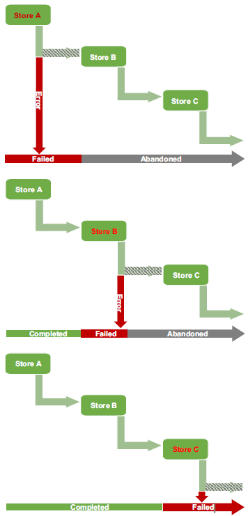

## 5.1 Reaching multiple outputs by copying
> Listing 5.1 Chapter5/Fluentd/file-source-multi-out.conf—copy to multiple outputs
```conf
<match *>
  @type copy   # Declaring the plugin to be used

  # copy_mode deep
  <store>
    @type null
  </store>
  <store>        # Start of the store block—each store reflects the action to take. 
                 # This is often done to store a log event using a plugin or forward to another Fluentd node. 
                 # In this case, we’re simply writing to the console.
    #### begin - stdout
    @type stdout
    #### end - std out
  </store>

  <store>        # Third store routes to a file
    #### begin file out
    @type file
    @id bufferedFileOut
    path ./Chapter5/fluentd-file-output
    <buffer>
      delayed_commit_timeout 10
      flush_at_shutdown true
      chunk_limit_records 500
      flush_interval 30
      flush_mode interval
    </buffer>
    <format>
      @type out_file
      delimiter comma
      output_tag true
    </format>
    #### end file out
  </store>

    @include additionalStore.conf
</match>
```
Let’s see the result of the configuration. As this uses a file source, we need to run the LogSimulator as well. So, to run the example, the following commands are needed:

* ``fluentd -c ./Chapter5/Fluentd/file-source-multi-out.conf``
* ``groovy LogSimulator.groovy ./Chapter5/SimulatorConfig/log-source-1.properties``

After running these commands, log events will appear very quickly on the console.Once the buffer reaches the point of writing, files will appear with the name ``fluentd-file-output.<date>_<number>.log``. It is worth comparing the content in the file to the console, as we have included additional attributes into the payload.

### 5.1.1 Copy by reference or by value
Copy mode has several settings that range in behavior from a copy by reference to a copy by value:

* ``no_copy``—The default state, and effectively copy by reference.
* ``Shallow``—This deep-copies the first layer of values. If those objects, in turn, reference objects, they are still referencing the same memory as the original. Under  the hood, this uses Ruby’s ``dup`` method. While faster than a deep copy, the use of dup needs to be used with care; it is comparable to ``no_copy`` of nested objects.
* ``Deep``—This is a proper copy by value, leveraging Ruby’s ``msgpack`` gem. If in doubt, this is the approach we recommend.
* ``Marshal``—When Ruby’s msgpack cannot be used, then native language object marshaling can be used. The object is marshaled (serialized) into a byte stream representation. Then the byte stream is unmarshaled (deserialized), and an object representing the byte stream is produced.


> **⚠ NOTE:** How copy operations work
> The following will help you better understand how copy behaviors work:
> * Ruby dup (shallow copy): http://mng.bz/mxOP
> * msgpack-ruby (deep copy): https://rubydoc.info/gems/msgpack
> * msgpack serialization (marshal): https://ruby-doc.org/core-2.6.3/Marshal.html

### 5.1.2 Handling errors when copying
However, suppose the output is being sent to a remote service, such as a database or Elasticsearch. In that case, the chance of an issue impacting one output and not another is significantly higher. For example, if one of the destination services has been shut down or network issues prevent communication, what happens to our outputs? Does Fluentd send the log events to just the available stores, or to none of them unless they are all available?

Fluentd does not try to apply ``XA transactions`` (also known as ``two-phase commit``), allowing an all-or-nothing behavior because the coordination of such transactions is resource-intensive, and coordination takes time. However, by default, it does apply the next best thing; in the event of one output failing, subsequent outputs will be abandoned.

For example, if we copy to three stores called Store A, Store B, and Store C, which are defined in the configuration in that order, and we fail to send a log event to Store A, then none of the stores will get the event (see the first part of figure 5.5). If the problem occurred with Store B, then Store A would keep the log event, but Store C would be abandoned (see the second part of figure 5.5.).

  
Figure 5.5 How a store error impacts a containing copy. The bar across the bottom of each diagram indicates which store would get the data value, which store failed, and which store was not actioned. For example, in the middle example, if Store B failed, then Store A will have got the log event, Store B wouldn’t have the event, and Store C would not be communicated with.


But if you have a buffer as part of the output configuration, this may mask an issue, as the buffer may operate asynchronously and include options such as fallback and retry. As a result, an error, such as giving up retrying, may not impact the copy process, as described. Given this approach, there is the option to sequence the copy blocks to reflect the priority of the output.

The downside is that if you use asynchronous buffering with retries, the buffer will allow the execution to continue to the next store. But if it subsequently hits the maximum retries, it will fail that store, but subsequent store actions may have been successful.

How priority/order is applied should be a function of the value of the log event and the output capability. For example, the use of the output plugin allows a **secondary** helper plugin such as **secondary_file**. If the log events are so critical that they cannot be lost, it is best to prioritize the local I/O options first. If the log event priority is to get it to a remote central service quickly (e.g., Kafka or Splunk) and is failing, then that means the event is of little further help elsewhere (e.g., Prometheus for contributing to metrics calculations); therefore, it’s best to lead off with the highest priority destination.

Fluentd does offer another option to tailor this behavior. Within the ``<store>`` declaration, it is possible to add the argument ``ignore_error`` (e.g., ``<store ignore_error>``). Then, if output in that store block does cause an error, it is prevented from cascading the error that would trigger subsequent store blocks from being abandoned. 

Using our example three stores again, setting ``ignore_error`` on Store A would mean that regardless of sending the event to Store A, we would continue to try with Store B. But if Store B failed, then Store C would not receive the event.

## 5.2 Configuration reuse and extension through inclusion
In listing 5.2, we have added several inclusions
by introducing ``@include additionalStore.conf`` after the last ``store`` tag defines additional store configurations from a separate file. This means we could define a common destination for all our log events and repeat the configuration across this and other configuration files to log all events in a common place, and then allow the configuration to focus on the destinations.

> Listing 5.2 Chapter5/Fluentd/file-source-multi-out2.conf—illustration of inclusion
```conf
<match *>
  @type copy

  # copy_mode deep
  <store>
    @type null
  </store>
  <store>
    #### begin - stdout
    @type stdout
    #### end - std out
  </store>

  <store>
    #### begin file out
    @type file
    @id bufferedFileOut
    path ./Chapter5/fluentd-file-output
    <buffer>
      delayed_commit_timeout 10
      flush_at_shutdown true
      chunk_limit_records 500
      flush_interval 30
      flush_mode interval
    </buffer>
    <format>
      @type out_file
      delimiter comma
      output_tag true
    </format>
    #### end file out
  </store>

  @include additionalStore.conf   # Incorporates the external file into the configuration providing an additional store declaration
</match>

@include record-origin.conf       # Brings a complete configuration set that could be separately run if desired or could be reused

```

We have also added an inclusion directive referencing the file ``record-origin.conf``. This illustrates the possibility that when multiple teams contribute functionality into a single run-time environment (e.g., a J2EE server), rather than all the teams trying to maintain a single configuration file and handling change collisions, each team has its own configuration file. But come execution time, a single configuration file uses inclusions to bring everything together. As a result, the Fluentd node needs to merge all the configurations together during startup. Within the ``record-origin.conf`` (if you review the content of ``record-origin.conf``), we have introduced some new plugins, which we will cover later in the chapter. 

Let’s see the result of the configuration. As this uses a file source, we need to run the LogSimulator as well. So, to run the example, the following commands are needed:
* ``fluentd -c ./Chapter5/Fluentd/file-source-multi-out2.conf``
* ``groovy LogSimulator.groovy ./Chapter5/SimulatorConfig/logsource-1.properties``

> **⚠ NOTE:** It is important to remember that the content of an inclusion can have an impact on the configuration, which has the ``include`` declaration. So the placement and use of inclusions must be done with care, as the finalized order of directives and their associated plugins is still applicable, as highlighted in chapter 2.

If the path to the included file is relative in the ``include`` statement, then the point of reference is the file’s location with the ``include`` directive. The ``include`` directive can use a comma-separated list, in which case the list order relates to the insertion sequence—for example, ``@include file.conf, file2.conf`` means ``file.conf`` is included before ``file2.conf``. If the ``include`` directive uses wildcards (e.g.,``@include *.conf``), then the order of insertion is alphabetical.

### 5.2.1 Place holding with null output
In listing 5.2, the additional inclusion fragment (``@include additionalStore.conf``) provided the configuration fragment shown in listing 5.3. This store definition uses the null output plugin; it simply discards the log events it receives. 

Placing null plugins when working in an environment where different teams may wish to output log events to different tools allows developers to build a service to put the placeholder in the Fluentd configuration ready for the other team(s) to replace. In many respects, the use of null is the nearest thing to adding a ``TODO`` code comment.

> **⚠ NOTE:** ``TODO`` is a common tag used in code to flag when something still needs to be done.

> Listing 5.3 Chapter5/Fluentd/additionalStore.conf—include configuration fragment
```conf
<store>
    @type null
    @id inclusion
</store>
```

### Putting inclusions with a MongoDB output into action
Let’s apply some of the insights to this scenario. Knowing where best to apply effort is best driven by analytical insights. Directing error events into a database makes it easy to get statistics over time showing what errors occur and how frequently. When combined with an appreciation of the impact of an error, the effort can be targeted with maximum value.

We need to apply this to ``Chapter5/Fluentd/file-source-multi-out.conf``.To help with this, the work from chapter 4, where we used Fluentd with a MongoDB
plugin, can be leveraged. We can capitalize on it to see the impact of copy errors and the use of the ignore_error option. To do this, create a copy of the ``Chapter5/Fluentd/file-source-multi-out.conf`` that can be safely modified. For simplicity,let’s call this copy ``Chapter5/Fluentd/file-source-multi-out-exercise.conf``. We need to replace the @type null with the configuration for MongoDB output. The commands you will need to run the scenario are
* ``fluentd -c ./Chapter5/Fluentd/file-source-multi-out-exercise.conf``
* ``groovy LogSimulator.groovy ./Chapter5/SimulatorConfig/logsource-1.properties``

With the changes applied, we should be able to complete the following steps:
1. Check the configuration using the dry-run capability. This should yield a valid result.
1. Confirm that the modified configuration produces the desired result by starting MongoDB and rerunning the LogSimulator and Fluentd.
1. Verify the behavior is as expected if we cannot connect to MongoDB, and repeat the same actions for running the LogSimulator and Fluentd.
1. The previous step should have highlighted the absence of the ``ignore_error`` option. Modify the Fluentd configuration adding the ``ignore_error`` option to
the console output configuration. Rerun the configuration and LogSimulator.Confirm that the desired behavior is now correct.

#####  ANSWERS
1.  The modified Fluentd configuration file should now look like ``Chapter5/ExerciseResults/file-source-multi-out-Answer1.conf`` and yield a
successful dry run.
1.  With MongoDB running, the database should continue to fill with events that
reflect the content sent to the file, and the console will still display content.
1.  With MongoDB stopped, the output plugin will start realizing errors, as there is
no configuration to ensure the issue does not cascade to impact other plugins.
None of the output streams will produce log events. This is because of the
default position that subsequent output plugins should not be executed once
an error occurs.
1.  With the ``ignore_error`` added to the configuration, the configuration should
now resemble ``Chapter5/ExerciseResults/file-source-multi-out-Answer2.conf``. With the MongoDB still stopped, the MongoDB output will fail,
but the failure will not stop output to the console but will inhibit output to the file.

## 5.3 Injecting context into log events
The ``inject`` operation can only be used with match and filter directives, which is
unfortunate, as we might want to apply it at the source. That said, it is not a significant
challenge to overcome if desired, as we will see shortly. Using our example configuration
``Chapter5/Fluentd/record-origin.conf``, we can see the injection at work
in listing 5.4.

When configuring the injection of time data, it is possible to configure different
representations of the time. This is covered by the ``time_type`` attribute, which
accepts values for

* ``String``—Allows a textual representation to be used and defers to the ``time_format`` attribute for the representation. The ``time_format`` uses the standard
notation, as described in appendix A.
* ``Float``—Seconds and nanoseconds from the epoch (e.g., 1510544836.154709804).
* ``Unixtime``—This is the traditional seconds from epoch representation.

In listing 5.4, we have gone for the most readable format of the string. In addition to
describing the time data format, it is possible to specify the time as **localtime** or as **UTC**
time by including the attributes ``localtime`` and ``utc``, which take Boolean values. Trying
to set both attributes could be the source of a lot of problems.

> Listing 5.4 Chapter5/Fluentd/record-origin.conf—Inject declaration
```conf
<match **>
  <inject>     # The inject declaration within the generic match
    hostname_key hostName       # Adds the name of the host of Fluentd and calls the value the name provided (e.g., hostName)
    #hostname - detail on how to obtain the hostname if you wanted to override it 
    worker_id_key workerId      # Adds the worker_id and calls it by the name provided. This helps when Fluentd has support processes to share the work across.
    tag_key sourceTag           # Puts the tag into the record output and uses the name provided
    time_key fluentdTime        # Provides the name for the time to be included with
    time_type string            # Defines how the date-time should be represented. 
                                # Here we are saying to provide a textual representation, but as we’ve omitted a value for time_format to define the format, use the standard format.
    localtime true
  </inject>
    @type stdout
</match>
```
The properties for the ``inject`` configuration relate to the mapping of known values
like hostname, tag, and so on, to attributes in the log event record.

To see this configuration in action, we have used the ``monitor_agent`` and ``stdout``,
so all we need to do is run Fluentd with the command ``fluentd -c ./Chapter5/fluentd/record-origin.conf``. The outcome will appear in the console, something like
```bash
2020-05-18 17:42:41.021702900 +0100 self: {"plugin_id":"object:34e82cc","plugin_category":"output","type":"stdout","output_plugin":true,"retry_count":0,"emit_records":4,"emit_count":3,"write_count":0,"rollback_count":0,"slow_flush_count":0,"flush_time_count":0,"hostName":"Cohen","workerId":0,"tag":"self","fluentdTime":"2020-05-18T17:42:41+01:00"}
```

Within this output, you will see that the injected values appear at the end of the JSON structure using the names defined by the attributes; for example, ``"hostName": "Cohen"``, where ``Cohen`` is the PC used to write this book.

### 5.3.1 Extraction of values
If we can inject certain values into the log event’s record, then it seems obvious that
there should be a counter capability for extracting values from the record to set the
tag and timestamp of the log event. This ability can be exploited by plugins that work
with source, filter, and match directives. This gives us a helpful means to set tags
dynamically based on the log event record content. Dynamically setting tags makes
tag-based routing very flexible. For example, if the log event had an attribute called
source, and we wanted to use that as a means to perform routing, we could use the
extract operation. For example:
```conf
<inject>
      tag_key nameOfLogRecordAttribute
</inject>
```
Unfortunately, only a subset of the plugins available takes advantage of the ``extract``
helper. One of the core plugins that does incorporate this ``exec``, which we have not covered
yet. So as we explore tag-based routing in the next section, we’ll use ``exec``, and
we will explore the interesting opportunities it offers.

## 5.4 Tag-based routing
In all the chapters so far, we have always had wildcards in the ``match`` declarations (e.g.,
``<match *>``), but we have had the opportunity to define and change the tag values at
different stages. We have seen the tag being manipulated in contexts ranging from
taking the tag value from the URI to setting the tag within the configuration and even
extracting the tag from the log event record, as just discussed. We can use the tags to
control which directives are actioned, which is the subject of this section.

We can control which directives will process and consume log events by defining
the match values more explicitly. For example, a configuration for two inputs called
AppA and AppB includes the ``tag`` attribute setting the respective tags to be AppA and
AppB. Now, rather than ``match *``, we set the directives to be ``<match AppA>`` and
``<match AppB>``. With this change, the match directives will only process log events
from the associated source.

In our example, to keep the sources simple, we have configured two occurrences
of the ``dummy`` source plugin to generate log events. We have added additional attributes
to control the behavior to repeat at different frequencies (with the ``rate`` attribute
representing the number of seconds between each log event generated) and
different messages (``dummy`` attribute).

In the following listing, we show the key elements of the configuration (we have
removed some configuration elements for clarity; this can be seen with the use of an
ellipsis [. . .]).

> Listing 5.5 Chapter5/Fluentd/monitor-file-out-tag-match.conf—tag matching
```conf
#### begin - AppA source
<source>      # The first of two source definitions in this configuration file, but note that the port numbers are different, along with several other configuration attributes, so the sources are easy to distinguish.
  @type dummy
  dummy {"hello from":"App A"}
  auto_increment_key AppACounter
  tag AppA
  rate 5
</source>
#### end - AppA source

#### begin - AppB source
<source>      # The second self_monitor source configuration. Most crucially, note the tag name differences between the sources.
  @type dummy
  dummy {"Goodbye from":"App B"}
  auto_increment_key AppBIncrement
  tag AppB
  rate 3
</source>
#### end - AppB source

#### begin - file out 1 - which will catch events from source 2 (tagged AppB)
<match AppB>     # The first of two match declarations. Note how we can use wildcard characters so partial name matching can be defined.
    @type file   # File output configuration mapping to different output files for each match (compare the path attributes)

    path ./Chapter5/AppB-file-output
    @id AppBOut
    <buffer>  ...  </buffer>
    <format>  ...  </format>   
</match>
#### end - file out 1

#### begin - file out 2 - which will catch events from source 1 (tagged AppA)
<match AppA>
    @type file  #  The second match, this time without any wildcarding

    path ./Chapter5/AppA-file-output
    @id AppAOut
    <buffer>  ...  </buffer>
    <format>  ...  </format>   
</match>
#### end - file out 2
```
This setup can be run with the command
``fluentd -c ./Chapter5/Fluentd/ monitor-file-out-tag-match.conf``
The output files should reflect the different dummy messages, as the routing will have
directed from the relevant source.

Despite the naming, it is still possible to use selective wildcarding with the tags. If
we extend this example by adding an additional source and tagging it ``AppAPart2``, we
could catch ``AppA`` and AppAPart2. This is done by modifying the ``<match AppA>`` to
become ``<match AppA*>``. The log events captured from the new source would be
incorporated into the ``AppA`` output.

This is illustrated in listing 5.6. If we do not want to reintroduce wildcard use, we
can also utilize a comma-separated tag list in the match declaration; for example,
``<match AppA, AppAPart2>``. To illustrate the wildcard behavior, this time we have
introduced another source plugin called exec. The exec plugin allows us to call OS
scripts and capture the result. We are simply using the ``more`` command (as it behaves
the same way for Linux and Windows) within the exec statement.


> Listing 5.6 Chapter5/Fluentd/monitor-file-out-tag-match2.conf—tag matching
```conf
#### begin - AppA source
<source>           # Original source, which remains unaltered
  @type dummy
  dummy {"hello from":"App A"}
  auto_increment_key AppACounter
  tag AppA
  rate 5
</source>
#### end - AppA source

#### begin - exec - execute a command and process response
<source>
  @type exec         # The additional source, using the exec source plugin
  command more .\TestData\valuePair.txt
  run_interval 7s
  tag AppAPart2
</source>
#### end - execute a command and process response

#### begin - AppB source
<source>       # The original AppB source, which remains unchanged
  @type dummy
  dummy {"Goodbye from":"App B"}
  auto_increment_key AppBIncrement
  tag AppB
  rate 3
</source>
#### end - AppB source

#### begin - file out 1 - which will catch events from source 2 (tagged AppB)
<match AppB> ... </match>   #  The match for AppB remains unmodified.
#### end - file out 1

#### begin - file out 2 - which will catch events from source 1 (tagged AppA)
<match AppA*>   # The original match for AppA has now been modified to include the wildcard, which means both AppA and AppAPart2 will be matched. 
                # This could described also be expressed as <match AppA, AppAPart2>.
    @type file
    path ./Chapter5/AppA-file-output
    @id AppAOut
    <buffer>  ...  </buffer>
    <format>  ...  </format>     
</match>
#### end - file out 2
```

This setup can be run with the command  
``fluentd -c ./Chapter5/Fluentd/ monitor-file-out-tag-match2.conf``
The output files should reflect the different dummy messages, but the ``AppA`` output
should now include the outcome of executing the OS command on a predefined test
data file.

> ### Tag naming convention
> Despite using wildcard characters to help select tags for different directives regardless of the position, there is a convention normally applied. 
> Tag naming typically follows a namespace-like hierarchy using the dot to break the hierarchy tiers (e.g.,``AppA.ComponentB.SubComponentC``). 
> Now the wildcard can filter the different namespaces (e.g., ``AppA.*`` or ``AppA.ComponentB.*``). 
> For example, if we had a web server hosting a domain with several different services, with each service potentially having one or more log outputs, we might see a convention of ``webserver.service.outputName`` in the tag convention.

## 5.5 Tag plugins
There are plugins available to further help with routing using tags; let’s look at some
certified plugins outside the core Fluentd (table 5.1).

When plugins are described as “certified,” it means they come from recognized
and trusted contributors to the Fluentd community. As these plugins are not part of
the core Fluentd, it does mean that to use these plugins, you will need to install them,
just as we did for MongoDB in chapter 4.

Table 5.1 Additional tag-based routing plugins that can help with routing
<table>
<tr><td>Plugin name and link</td><td>Description</td></tr>
<tr><td>rewrite-tag-filter <br/>https://github.com/fluent/fluent-plugin-rewrite-tag-filter</td><td>With one or more rules in the match directive, the log event has a regular expression applied to it by the plugin. Then, depending on the result, the tag is changed to a specified value. The rule can be set such that you can choose whether the rewrite is applied to a true or false outcome from the regex. The log event is re-emitted to continue beyond the match event using the new tag if a successful outcome is achieved.</td></tr>
<tr><td>route <br/>https://github.com/tagomoris/fluent-plugin-route</td><td>The route plugin allows tags to direct the log events to one or more operations, such as manipulating the log event and copying it to intercept it by another directive.</td></tr>
<tr><td>rewrite <br/>https://github.com/kentaro/fluent-plugin-rewrite</td><td>This enables tags to be modified using one or more rules, such as if an attribute of the log event record matches a regular expression. As a result, performing specific tasks based on the log event becomes very easy.</td></tr>
</table>

### 5.6.1 Using a stdout filter to see what is happening
To help illustrate the point, we will introduce a special filter configuration. The
important thing about filters with stdout, unlike match directives, is that even if the
event satisfies the filter rule, it is emitted by the plugin to be consumed by whatever
follows. This setup for a filter is a bit like a developer’s ``println`` for helping to see
what is happening during code development. We will look more closely at filters in the
next chapter, but for now, let’s see how the stdout plugin behaves in a filter.
The stdout plugin effectively accepts all events; thus, the following filter will let
everything pass through and send the details to the console:
```conf
<filter *>
     @type stdout
</filter>
```
This configuration is typically referred to as ``filter_stdout``. Using this as an additional
step will help us illustrate the label pipeline behavior. This is another handy way of
peeking at what is happening within a Fluentd configuration.


### 5.6.2 Illustrating label and tag routing
To illustrate a label-based pipeline, we have created a configuration that tails two separate files (from two different log simulators). The configuration of the simulator output results in two differing message structures (although both are derived from
the same source data). To observe the differences, compare`` basic-file.txt`` and
``basic-file2.txt`` once the simulators are running.

The configuration will illustrate the use of a label being applied to one source and
not another. Then, within the label “pipeline,” one source (file) will be subject to both
the stdout filter (as explained in section 5.6.1) and a file output that is separate from
the output of the other file. This is illustrated in the following listing. As with other
larger configurations, we have replaced sections with ellipses, so relevant aspects of
the configuration are easier to read.

> Listing 5.7 Chapter5/Fluentd/file-source-file-out-label-pipeline.conf label pipeline
```conf
#### begin - tail basic file
<source>
  @type tail
  path ./Chapter5/basic-file.txt
  read_lines_limit 5
  tag basicFile
  pos_file ./Chapter5/basic-file-read.pos_file
  read_from_head true
  <parse>
    @type none
  </parse>
  @label labelPipeline    #  Our source attaches a label to the events it creates; in this case, labelPipeline. 
                          #  This will mean the step operation performed on these events will be in the <labellabelPipeline> block.
</source>
#### end - monitor_agent 1

#### begin - tail basic-file2
<source>                  #  This source is unlabeled. 
                          #  As a result, its log events will be intercepted by the next match blog that can consume the tag basicFILE2.
  @type tail
  path ./Chapter5/basic-file2.txt
  read_lines_limit 5
  tag basicFILE2
  pos_file ./Chapter5/basic-file-read2.pos_file
  read_from_head true
  <parse>
    @type json
  </parse>
</source>
#### end - tail basic-file2

<label labelPipeline>        # At the start of the label block, any log events with a label 
                             # that match will pass through this sequence of operations, 
                             # assuming the processing allows the event to output from the plugin.

  #### use the stdout filter - to illustrate multiple steps within a label
  <filter *>                 # Use the stdout filter to push the log events to stdout and output to the next plugin.
    @type stdout
  </filter>

  #### begin - file out 1 
  <match *>                  # Use the match to direct content to a file.
      ## as we're using a label to establish the pipeline then we can wild card the match
      @type file
      path ./Chapter5/label-pipeline-file-output
      @id otherSelfOut
      <buffer>...</buffer>
      <format>...</format> 
  </match>
  #### end - file out 1

  #### to illustrate that we have consumed the event with the previous match - add a std out inside the pipeline
  <match *>            #  We will never see any result from this stdout filter,as the preceding match will have consumed the log event. 
                       # To send log events to both stdout and the file would require the use of the copy.
    @type stdout
  </match>
  #### end std out
</label>               # Defines the end of the label series of events
#### end label - labelPipeline

#### begin - file out 2 - for log events with the tag basicFILE2
<match basicFILE2>     # Outside of a label, the match will be applied to all no label events.
    @type file
    path ./Chapter5/alt-file-output
    @id basicFILE2Out
    <buffer>...</buffer>
    <format>...</format>  
</match>
#### end - file out 2
```
To run this configuration, we need to run the commands
* ``fluentd -c Chapter5/Fluentd/file-source-file-out-label-pipeline.conf`` 
* ``groovy LogSimulator.groovy Chapter5/SimulatorConfig/basic-log-file.properties``
* ``groovy LogSimulator.groovy Chapter5/SimulatorConfig/basic-log-file2.properties``

When running this setup, the log events can be seen in ``basic-file.txt`` and on the
console. Additionally, there will be two more files, as the log content is output to
``label-pipeline-file-output.*_*.log`` and ``alt-file-output.*_*.log`` (wildcards
represent the date and file increment number). Neither file should have tags
mixing.

While the match expression defined continues to use a wildcard within the label
pipeline, it is possible to still apply the tag controls on the directives within the pipeline.
If you edit the configuration setting to align the match clause with ``<match basicFILE2>``, you will see the logs displayed on the console but not in the file.