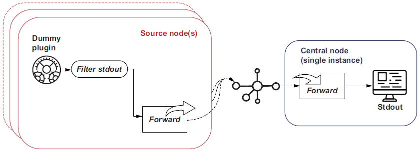

### 7.1.1 Seeing workers in action
The best way to understand the behavior of worker processes is to configure an example
and see what actually happens. The most straightforward way to illustrate workers
is to create a variation of the Hello World configuration. We will establish multiple
workers and attribute to the workers the application of the dummy source plugin.
Using the dummy source plugin means the source doesn’t have I/O dependencies
impacting behavior. The relevant ``match`` directives then push the output to stdout.
Using a filter, we can inject into the log event which worker was involved in the process,
building on what we learned in the previous chapter.

Let’s define how many workers we will use and add this into the system directive
alongside the ``log_level`` attribute we have been setting. This is done by setting the
attribute ``workers`` in the system directive.

To define explicitly what each worker does, we wrap the directives in a directive of
``<worker x>`` where x represents the numeric worker ID that will execute the directives.
For example, ``<worker 2>`` would use the third worker (IDs start at 0). If we want to
effectively allocate more resources (i.e., workers) to a specific set of directives, we can
specify a range of workers in the directive. For example, ``<worker 1-3>`` would allocate
workers 1, 2, and 3 to perform the same activities. All workers will get directives not
assigned. So worker 0 in our configuration would process only these directives.

In listing 7.1, we have defined four workers and have deliberately left the
subsequent directives outside of the worker configuration. The result of this is that
every worker will pick up the configuration. This means we can share a common
output—but this has to be handled with care, as it can have undesirable side effects.
These side effects can range from losing events to storage corruption, such as the
problem of multiple processes trying to write to the same file. In our example, we’re
just applying a filter to extract the ``worker_id``, add it to the log event, and send it to
``stdout`` (console).

> Listing 7.1 Chapter7/Fluentd/dummy-stdout-multiworker.conf—illustrating workers
```conf
<system>
  log_level info
  workers 4  # Declares the number of workers
</system>

<worker 0>   #  Activities specific to worker 0
  <source>
    @type dummy
    tag w0
    auto_increment_key counter
    dummy {"hello":"from worker 0"}
  </source>
</worker>

<worker 1-2>  #  Defines activities for two workers
  <source>
    @type dummy
    tag w1
    auto_increment_key counter
    dummy {"hello":"from worker 1-2"}
  </source>
</worker>

<worker 3>
  <source>
    @type dummy
    tag w2
    auto_increment_key counter
    dummy {"hello":"from worker 3"}
  </source>
</worker>

<source>   # Defines a source outside of the workers—we should see this being picked up by all workers.
  @type dummy
  tag w-any
  auto_increment_key counter
  dummy {"hello":"from workerless"}
</source>

<filter *>
  @type record_transformer
  enable_ruby
  <record>
    worker_id ${ENV['SERVERENGINE_WORKER_ID']}   # Uses a filter to add the ID of the worker involved in that log event
  </record>
</filter>

<match *>
  @type stdout
</match>
```

This configuration can be started up with the command

``fluentd -c Chapter7/Fluentd/dummy-stdout-multiworker.conf``

Before examining the stdout console, it is worth seeing what is happening in terms of
processes. With a command console in Windows or a Linux shell, the following appropriate
command should be run:

```bash
Windows: tasklist /fi "IMAGENAME eq Ruby.exe"
Linux: ps -ef | grep ruby
```

These commands will show you the Ruby processes, which will include Fluentd processes.
As a result, you should see five processes listed if Fluentd is the only Ruby solution
running. If other Ruby solutions are running, we can differentiate them, as the
Fluentd processes will have identical or very nearly identical start times. The processes
are made up of four workers and one controller process.

> **⚠ TIP**    We can make processes easier to identify by using the ``process_name`` attribute in the ``<system>`` configuration (e.g., ``process_name`` Fluentd).

With the Fluentd processes having been run for a while, we’ll want to shut things
down. This is a little more complex to do now, as we have multiple processes. For Windows,
this can be done with the command line ``taskkill /IM Ruby.exe /F``, and the
Linux equivalent is ``pkill -f ruby`` as long as you don’t have any other Ruby processes
running. If you have other Ruby processes running, you’ll have to isolate the
processes and manually kill each one.

Looking through the stdout results from having run Fluentd with the ``dummy-stdout-multiworker.conf`` configuration file, you should be able to see that the
following has occurred (but be aware there is a level of arbitrary behavior):
* Log events with the tag w-any will appear with any of the ``worker_id`` entries.
* Logs linked to tag w0 (including ``"hello":"from worker 0"``) will only be
linked to ``"worker_id":"0"``.
* Logs linked to tag w1 (including ``"hello":"from worker 1-2"``) will only be
linked to ``"worker_id":"1"`` or ``"worker_id":"2"``.

### 7.1.2 Worker constraints
When using workers, there are some constraints that need to be considered. This
relates to how processes can share (or not) resources such as file handles. So if you
allocate multiple workers to a Fluentd configuration that writes to file output, the file
needs to be separated, as only one worker can use one file properly. We can solve this
by setting the file path to include the ``worker_id``; for example, path ``"logs/#{worker_id}/${tag}/%Y/%m/%d/logfile.out``.

Sharing ports among workers can be realized when the plugin uses the ``server``
helper plugin or when the plugin can natively handle the sharing of ports. The ``forward``
plugin is an example of native port management. As each process cannot use the
same port, a reliable mechanism to overcome this and select suitable ports is needed.
When the server helper plugin is used, it will then allocate consecutive ports to each
worker. So if we had specified the use of four workers and then defined the use of a
``monitor_agent`` plugin with a port set to 30000, then worker 0 uses port 30000, worker 1
uses 30001, worker 2 uses 30002, and so on. If you are using workers, ensure that the
ports being used are well separated. Separating the ports will avoid potential port collisions
because the algorithm assigns the same port to different plugin instances
across multiple workers. For example, specifying ports 30000 and then 30002 to different
plugins, but then introducing four workers, would see ports 30002 and 30003 trying
to be used by two different plugins.

## 7.2 Scaling and moving workloads
Chapter 4 looked at the output plugins’ ability to work with buffers, which will provide
us with a means to optimize the performance around each I/O activity, particularly
with the memory buffer. Beyond buffers and the tuning of threads and workers, the
scaling options are about workload distribution. This could be achieved by

* Feeding the log events to an event stream technology like Kafka.
* Using tools such as Redis or Memcached for large-scale caches.
* Taking advantage of Fluentd’s ability to pass log events to other Fluentd nodes.

This ability provides the opportunity to move the workload to dedicated Fluentd
nodes, either fanning out if the workload needs a lot of additional computing
power, or, more likely, fanning in, bringing lots of log events from many
smaller nodes down to one or two Fluentd instances.
In the following sections, we’ll look at the fan-in (sometimes referred to as ``concentrator``
or ``aggregator networks``) and fan-out deployments, as they are implemented using the
same core set of plugins.

Fluentd’s compute footprint is so small, we can run some configurations to illustrate
the setup on a single machine.

### 7.2.1 Fan-in/log aggregation and consolidation

##### FLUENTD CONFIGURATION FOR FAN-IN
Let’s walk through the setup of this kind of concentrator network configuration.
We will need two Fluentd configuration files, one of which will work for as many
source servers as we want to represent using the ``forward`` plugin as an output. A second
configuration uses ``forward`` as an input to process and direct traffic to a final destination.
To keep things simple, we’ll use the dummy source plugin rather than
running the simulators. To make the origin node easy to identify, we need to incorporate
something into the log event. Normally we could do that with the node hostname,
but since we’re running everything on a single machine, that doesn’t help us.
Another approach to this is to retrieve an environmental variable and use it for the tag
name. As long as the environment variable scope is restricted to the scope of the shell
used to launch the Fluentd instance, this will work. Figure 7.5 illustrates the configuration
in more detail.

  
Figure 7.5 A detailed view of how multiple Fluentd nodes running the same configuration feed a single instance

To get the environment variable into the payload, we’ve added a filter into the source,
which takes the tag value and is set using the Ruby command ``"#{ENV["Node-Name"]}"``; this retrieves the value of ``NodeName``.

> Listing 7.2 Chapter7/Fluentd/dummy-foward1.conf—illustrating forward out
```conf
<system>
  log_level info
</system>

<source>
  @type dummy
  tag "#{ENV["NodeName"]}"    #  Here, we are grabbing the
environment variable to
make each instance distinct.
  auto_increment_key counter
  dummy {"hello":"world"}
</source>

<filter *>
  @type stdout
  <inject>                   #  Puts the tag into the log event record
    tag_key fluentd_tag
  </inject>
</filter>

<match *>
    @type forward           # Declares the forward plugin output
    buffer_type memory
    flush_interval 2s       # Buffers up events before sending; for convenience,we’re limiting this. In the real world, you’d probably consider a longer duration.
    <server>                # Defines the target server to direct the log event to
      host 127.0.0.1
      port 28080
    </server>  

  <secondary>               # If we can’t communicate with the central Fluentd instance, we need to send the log events somewhere.
                            # In this configuration,we’re just sending the events to the console if they can’t be handled.
                            # You’ll probably want to do something more robust in a production scenario, like writing events to a file.
    @type stdout
  </secondary>
</match>
```
Before starting Fluentd, the shell used to run Fluentd will need to ``set`` or ``export``
(Windows or Linux) ``NodeName=Node1``. Each source node has a new number in the
assignment. Then we can start up Fluentd with

``fluentd -c Chapter7/Fluentd/dummy-forward1.conf``

Repeat the steps of starting a shell, setting the environment variable, and launching
the source Fluentd node to get a second Fluentd node generating log events and
sending them to the central Fluentd node.

> **⚠ NOTE**   If the environment variable is not set up, and if Fluentd is showing its configuration (at the info log level), you can see if the value has been properly inserted. If the value is absent, depending on the attribute, you’ll observe a startup error at best; at worst, things will start up but not appear to do anything.This comes from the fact that a default value may be defined and taken. For example, the ``port`` attribute will be 0.

We have used a filter to ensure that the tag is captured into the log event. In addition,
we can also utilize the ``stdout`` plugin so the console from the sender will show us the
log events that we should receive in the central node. Ideally, we need to run several
shells and set the environment variable accordingly. Depending on how long it takes
to start up the central (consuming) node, periodic network errors will be reported on

the source nodes, as there is no response to the network calls.
This brings us to the consuming configuration, which is simply accepting the forwarded
events and pushing them out to the console. We’ve seen much of this before,
although the use of the ``forward`` plugin is new. For Fluentd to receive the events, we
need to define a Fluentd source, which binds to a network address and port. This obviously
needs to match the sender’s configuration. We can see all of this in the following
listing.

> Listing 7.3 Chapter7/Fluentd/forward-stdout.conf—illustrating forward as a source
```conf
<source>        # Defines the use of the input forward plugin
  @type forward
  port 28080    # Network address to bind to (DNS or IP)—in our case localhost. This needs to match the sender.
  bind 127.0.0.1
</source>

<match *>       # Shows on the console what log events have been sent
  @type stdout
</match>
```
With the consuming Fluentd node defined, we can fire up a single instance (for the
more common concentrator network). Once all the Fluentd nodes are communicating,
we’ll see all the log events in this node’s console. So, let’s start up the consumer
node with the command

``fluentd -c Chapter7/Fluentd/forward-stdout.conf``

When you look at the console output now being generated, you should see that the
node name included in the console output will vary. The variation reflects that the log
events are from two different Fluentd nodes, as we made the tag values dynamic in the
configuration.

> **⚠ NOTE** The application of the msgpack plugin will help reduce network traffic,as a formatter can be set to msgpack for the forward plugin. The receiving forward plugin can recognize msgpack-formatted events and automatically unpack them. As a result, Fluentd-to-Fluentd traffic is transmitted very efficiently.


### 7.2.2 Fan-out and workload distribution
#### FLUENTD CONFIGURATION FOR FAN-OUT
With both fan-out and high-availability deployments, we need to have the ability to
send workload to potentially multiple nodes. In the context of high availability, sending
traffic to a different node will be triggered by communication loss, and in fan-out,
the connectivity is driven by workload sharing. Let us examine both requirements, as
there is some commonality in the configuration. As shown in figure 7.7, this time we
will deploy only one node with the dummy source generator, but route log events to
multiple consumer nodes that will output to the console.

  
Figure 7.5 Our example configuration of Fluentd fan-out with one node passing log events to multiple nodes to process

The key difference between this and the previous source node configuration is that
the configuration of the ``forward`` plugin will now need multiple servers specified. In
high availability, which node should be considered the primary and which should be
the standby must be addressed. For fan-out, we may want to weigh the workload in
favor of one node over another. All of this can be done within the configuration
through properties. For multiple servers, as shown in listing 7.4, we can simply declare
multiple contiguous blocks of attributes for the server helper plugin <server>. As
this is a basic fan-out, we have added a ``weight`` attribute to establish a ratio of workload
between the servers. In our case, that ratio is 10:1. If unspecified, then all the
nodes get the same weighting applied.

> Listing 7.4 Chapter7/Fluentd/dummy-forward2.conf—illustrating forward to multiple servers
```conf
<source>
  @type dummy
  tag dummy-fanout-source
  auto_increment_key counter
  dummy {"hello":"world"}
</source>

<filter *>
  @type stdout
  <inject>
    tag_key fluentd_tag
  </inject>
</filter>

<match *>
    @type forward
    buffer_type memory
    flush_interval 2s   
    <server>             # First server definition with its differing ports so we can run on the same host
      host 127.0.0.1
      port 28080
      weight 10          # Defining the weighting, which will favor the first server configuration. If unset, this value defaults to 60.
    </server>  
    <server>
      host 127.0.0.1
      port 38080         # Defines alternate port
      weight 1           # Weighting set to bias traffic away from this server
    </server>  

  <secondary>
    @type stdout
  </secondary>
</match>
```
As we’re running everything on the same machine, the Fluentd instances forming the
fan side will need to be configured to operate on different network ports to avoid conflicts.
A production-like environment with the Fluentd instances is configured to run
on separate servers but using the same network port. Utilizing the naming trick we
saw in listing 7.2, we can make the value configuration-driven and avoid needing multiple
configuration files with different values. As a result, each node will need an environment
variable called ``NodePort``, defining one of the ports used on the source side
of the node configuration, as shown in the following listing.

> Listing 7.5 Chapter7/Fluentd/forward-stdout2.conf
```conf
<source>
  @type forward
  port "#{ENV["NodePort"]}"      # Setting the port number up dynamically allows us to run the same configuration twice.
  bind 127.0.0.1
</source>

<match *>
  @type stdout
</match>
```
Let’s see what happens with this configuration of nodes. Start the source node with the command

``fluentd -c Chapter7/Fluentd/dummy-forward2.conf``
 
Then we need to configure a shell with the command ``set NodePort=28080`` for Windows
or ``export NodePort=28080`` in a Linux-based environment. Once this is set, we
can start the Fluentd instance with the command

``fluentd -c Chapter7/Fluentd/forward-stdout2.conf``

We then repeat the steps again, replacing ``28080`` with ``38080`` in the ``set/export`` step.
Once everything is running, the log events should appear on the consoles of the
Fluentd instances running the ``dummy-forward2.conf`` configuration. With the ratio
set, we should see that the logs are heavily biased to the node running on port 28080.
But if you count how many updates go to one console over the other, you’re not guaranteed
to see every output on the server using the 38080 port and ten on the other, as
the ratio is calculated every time we want to send an output. The calculation then
yields a value that will dictate on which side of the ratio it will fall.

#### ROUNDROBIN PLUGIN
Another way of distributing the workload is to leverage the ***roundrobin*** plugin. This
plugin is a core Fluentd output plugin that works with the ``store`` helper plugin. This
is illustrated in the following listing, with a ``roundrobin`` rotating the outputs to each
individually identified server. As this is for a fan-out implementation, each ``store``
block will use a ``forward`` plugin, but that isn’t mandatory.

> Listing 7.6 Chapter7/Fluentd/dummy-forward3.conf—illustrating the use of roundrobin
```conf
<source>
  @type dummy
  tag dummy-fanout-source
  auto_increment_key counter
  dummy {"hello":"world"}
</source>

<filter *>
  @type stdout
  <inject>
    tag_key fluentd_tag_roundrobin
  </inject>
</filter>

<match *>
    @type roundrobin     #  To get the roundrobin behavior, we need to use it as the output plugin. 
                         #  It will then use each store helper plugin in turn, in the same way as the copy plugin uses all the store helpers.

    <store>              #  Declares the store configuration, but as we want the roundrobin to use each target equally, 
                         #  the configuration for a store can have only one server.
      @type forward
      buffer_type memory
      flush_interval 1s  
      weight 50
      <server>           #  The server definition for the destination
        host 127.0.0.1
        port 28080
      </server>  
    </store>
    <store>
      @type forward
      buffer_type memory
      flush_interval 1s        
        weight 50

      <server>
        host 127.0.0.1
        port 38080       # The second server configured to be using a different port
      </server> 
    </store>

  <secondary>
    @type stdout
  </secondary>
</match>
```
Let’s look at how the ``roundrobin`` behaves in comparison to the weighting. We need
to start up as before; if the console for the two fan nodes doesn’t have the variable set
for ``NodePort``, we need to reestablish the settings. We then start the event source Fluentd
instance with the command

``fluentd -c Chapter7/Fluentd/dummy-forward3.conf``

Then start the two instances of the fan node using the same command:

``fluentd -c Chapter7/Fluentd/forward-stdout2.conf``

This time the output will consistently go to the alternate console outputs as the ``roundrobin``
deliberately ensures the allocation is consistently even. The use of the weight
attribute can also be applied, but this does undermine the ``roundrobin`` behavior.

### 7.2.3 High availability
The configuration for the high-availability arrangement is not that different from the
fan-out. Rather than using the ``weight`` attribute to distribute the workload, we use the
``standby`` attribute and set one node to have the value true and the other false. An
example of the server part of a match plugin can be seen here:

```conf
<server>
    name myserver1
    host 127.0.0.1
    port 28080
    standby false
</server>
<server>
    name myserver2
    host 127.0.0.1
    port 38080
    standby true
</server>
```
As the fragment shows, we have defined two servers; for example, using the forward
output plugin would be two instances of Fluentd to send log events to. When the
Fluentd instance with this configuration starts up, it will try to send the log events
using the server named **myserver1**, as it is marked as not being the standby. However,
if this Fluentd instance experiences communication issues with **myserver1**, it will
send the log events to the ``standby`` called **myserver2**.

In this fragment, we have used the ``name`` attribute. The name is normally used only
for Fluentd logging and certificate verification. But as you can see, using the ``name``
attribute can also help you determine which server is which, particularly when IP
addresses rather than meaningful DNS names are being used.

### 7.2.4 Putting a high-availability comparison into action
Your customer wants to see how a high-availability configuration differs in setup and
behavior. Your team has agreed that configuration files ``Chapter7/Fluentd/dummyforward2.conf`` and ``Chapter7/Fluentd/forward-stdout2.conf`` should be
refactored to provide the comparison.

Once the configuration has been refactored, run the two configurations and shut
down individual instances of ``Chapter7/Fluentd/forward-stdout2.conf``. Note
the resultant behavior to show the customer the differences.

##### ANSWER
The configuration to illustrate high availability based upon Chapter7/Fluentd/
dummy-forward2.conf and ``Chapter7/Fluentd/forward-stdout2.conf`` can be
found in Chapter7/ExerciseResults/dummy-forward2-Answer.conf and
Chapter7/ExerciseResults/forward-stdout2-Answer.conf.

The only change of importance in the configuration is removing the ``weight`` attribute
and introducing the attribute ``standby`` set to ``true`` or ``false`` in the relevant
server configuration. The difference can be observed as soon as the nodes have
started (it’s best to start ``dummy-forward2-Answer.conf`` node using port ``38080``,
so it doesn’t immediately think the primary destination node is down and switch to
the reserve). The console output will only show up on the node listening to port
``28080``. However, when this node is shut down, the log events will pass to the Fluentd
instance working on port 38080.`

### 7.3.5 Options comparison
Having looked at the different deployment models, we should take the time to understand
the pros and cons of the different approaches. In table 7.1, we’ve taken each of
the patterns described and pulled out the pros and cons of both Fluentd and Fluent Bit.

Table 7.1 Fluentd deployment options in a containerized environment

<table>
      <tr><td>Approach</td><td>Pros</td><td>Cons</td></tr>
      <tr><td>Fluentd as part of the worker node</td><td>Simplest in terms of deployment, as it involves only the worker node. No need to change pods or containers to deploy patches to Fluentd.</td><td>Requires more work to translate logs back into more meaningful structures. To apply meaning to log events requires some context, such as an understanding of the application or service. The downside is that the application context resides outside the application domain (the services used). Fluentd patching configuration changes impact the entire worker node.</td></tr>
      <tr><td>Fluentd in the application container</td><td>Isolates configuration to the smallest component.</td><td>A larger compute footprint, running lots of instances of Fluentd—this makes Fluent Bit a better proposition.</td></tr>
      <tr><td>Fluent Bit in the application container</td><td>Isolates configuration to the smallest component. Smaller footprint than Fluentd.</td><td>Total compute effort increases compared to the other models. But smaller than Fluentd. Limitations in terms of types of inputs that can be consumed, as the plugin options are smaller.</br>Fluent Bit is not as rich as Fluentd concerning available plugs, limiting the processes performed on the log events.</td></tr>
      <tr><td>Fluentd as a sidecar</td><td>Minimizes the number of Fluentd instances within a pod. Service awareness is linked to an application’s pod (e.g., intercepting specific log events). Potential to use a generic Fluentd container and leverage configuration to dynamically retrieve configuration.</td><td>More complex pod configuration.Fluentd patch process is more complex, as it has an impact on the pod. The container will be a bit larger than a Fluent Bit variant.</td></tr>
      <tr><td>Fluent Bit as a sidecar</td><td>Minimizes the number of Fluentd instances within a pod.<br/>Service awareness is linked to an application’s pod definition (e.g., intercepting specific log events).<br/>Smaller footprint than Fluentd.<br/>Log event handling is within the application context.<br/>
Potential to use a generic Fluentd container and leverage configuration to dynamically retrieve configuration.<br/></td><td>More complex pod configuration. Fluentd patch process is more complex, as it will impact each pod.</td></tr>
</table>

## 7.4 Securing traffic between Fluentd nodes
### 7.4.1 TLS configuration
> More on TCP and UDP
> For more information on how these protocols can be used, the following resources will help:
> * www.vpnmentor.com/blog/tcp-vs-udp/
> * www.cs.dartmouth.edu/~campbell/cs60/socketprogramming.html
> * www.openssl.org/docs/

#### TLS VERSION AND ALGORITHM
The version of TLS that can be supported can be controlled through the Fluentd
configuration. TLS 1.3 (published as RFC 8446; https://tools.ietf.org/html/rfc8446
in August 2018) is presently the latest version of the standard published. Currently,
TLS 1.2 is the default version used by Fluentd, reflecting that TLS 1.2 is the most
widely adopted. Industry practice recommends using the latest version of TLS possible
(as it is the most secure) and accomodating lower versions only where necessary.
The TLS compatibility and cipher options can be managed via the ``version`` and
``ciphers`` attributes.

#### SPECIALIZED FORWARD PLUGIN FOR SSL/TLS
There is a secured version of the forward plugin for both in and out actions, as previously
referenced. This can be deployed like all plugins using gem. For example:

``gem install fluent-plugin-secure-forward``

This version of the plugin still requires certificates but simplifies the configuration
and masks the transport layer configuration section.

### 7.5.1 Simple credentials use case
We can define username and password credentials as part of a security configuration
between Fluentd nodes. This allows a Fluentd node receiving forwarded log events to
have an increased level of trust.

The credentials are obviously associated with a server, so in the forward output
configuration, we provide the attributes ``username`` and ``password`` in the ``server``
attributes set. In the following listing, we have taken the ``dummy-forward.conf`` and
extended it to include the credentials.

> Listing 7.7 Chapter7/Fluentd/dummy-user-forward1.conf with user credentials
```conf
<source>
  @type dummy
  tag "#{ENV["NodeName"]}" 
  auto_increment_key counter
  dummy {"hello":"world"}
</source>

<filter *>
  @type stdout
  <inject>
    tag_key fluentd_tag
  </inject>
</filter>

<match *>
    @type forward
    buffer_type memory
    flush_interval 2s   
    compress gzip

    <security>    #  Mandatory attributes need to be provided for security, 
                  #  which include a logical name and a common key.
      shared_key hello
      self_hostname source_host
    </security>

    <server>
      host 127.0.0.1
      port 28080
      username hello-this-is-a-long-username
      password world-of-security-likes-long-passwords
    </server>  

  <secondary>
    @type stdout
  </secondary>
</match>
```

Building on ``forward-stdout.conf``, the consumer side also needs the same credentials
to verify against. In listing 7.8, we show the additional attributes involved. The
consumer side will need the username and password specified and an explicit indication
in the ``security`` structure using the attribute ``user_auth``. The server logical
name should expect the forwarded log event to be defined using the attribute ``self_hostname`` and mandatory security attribute ``shared_key``.

> Listing 7.8 Chapter7/Fluentd/forward-user-stdout.conf receiving with credentials
```conf
<source>
  @type forward
  port 28080
  bind 127.0.0.1
  <security>            # Starts the security configuration
    user_auth true      # Tells Fluentd that we must apply user authentication
    self_hostname destination_host   # Declares how this node should be addressed by the client
    shared_key hello
    <user>                        # Declares the credentials expected to arrive
      username hello-this-is-a-long-username
      password world-of-security-likes-long-passwords
    </user>  
  </security>
</source>

<label @FLUENT_LOG>
  <match fluent.*>
    @type stdout
  </match>
</label>

<match *>
  @type stdout
</match>
```
We can run this configuration with one shell running:

``fluentd -c Chapter7/Fluentd/forward-user-stdout.conf``

Along with this, we need another Fluentd running. Before starting Fluentd, the shell
used to run Fluentd will need to ``set`` or ``export`` (Windows or Linux) ``NodeName=Node1``. Each source node has a new number in the assignment. Then we can start up
Fluentd with 

``fluentd -c Chapter7/Fluentd/dummy-user-forward1.conf``

Everything should run as it did when we ran without the user credentials. However, we
are validating credentials on the consumer side. Stop the client side, change the password,
and restart that Fluentd instance. This will now fail with reported password
issues.

### 7.5.2 Putting certification into action
Your company needs the Fluentd deployment to span multiple data centers so that the
security team can use their preferred monitoring tool across the WAN. Your chief security
officer (CSO) is pleased that an element of security is applied for internode communication.
But they are not happy that credentials could be communicated in
cleartext. The CSO has approved the use of Fluentd nodes spanning the company-wide
network as long as you can provide SSL/TLS configuration to encrypt the traffic. The
data centers do not have direct internet connectivity to enable validating and direct distribution
of certificates from a public CA. There isn’t an internal CA at present,
although there are discussions about one in the future. The infrastructure team has
said that they will distribute self-signed certificates for you. Therefore, we will need to
configure Fluentd using self-signed certificates. To demonstrate that the infrastructure
team can meet certificates requirement and that they understand what is needed, it has
been agreed that ``dummy-user-forward1.conf`` and ``forward-user-stdout.conf``
will be modified to include the use of self-signed certificates to prove the process.

#### ANSWER
Proof that the solution will work can be achieved by running the Fluentd nodes by
replacing the certificate or key file with a dummy file. This should cause the data
exchange to fail.

The example configuration can be found in the configuration files ``Chapter7/ExerciseResults/dummy-user-forward1-Answer.conf`` and ``Chapter7/ExerciseResults/forward-user-stdout1-Answer.conf``. We have referenced
dummy certificate files within the Fluentd configurations (if used, this will trigger a
failure). For this to work, you will need to replace these files with proper certificates.
As the certificates take details and have a lifetime, you should create your own certificates
and replace the dummy file with the certificates you generate. This is because
certificates can be linked to identities and have defined lifetimes. Guidance on how to
do this using OpenSSL (www.openssl.org) can be found in the liveBook version of ***Understanding API Security*** by Justin Richer and Antonio Sanso (Manning, 2017) at
http://mng.bz/QWvj.

An alternative approach is to adopt Let’s Encrypt, which will provide an automated
mechanism to renew certificates (https://letsencrypt.org/).

In the configuration, you’ll note that we have opted to switch from the standard
forward plugin to the secure forward plugin, so we don’t explicitly need to set the
transport layer attributes. We have also assumed that the passphrase used in creating
the key and certificate is ``your_secret``. To change the configuration-held passphrase
to align with what was used, you’ll need to modify the ``forward-user-stdout1-Answer.conf``, which contains an attribute called ``ca_private_key_passphrase``
that will need the correct value.
To run the configuration, we’d need to start the Fluentd nodes with the
commands

```bash
fluentd -c Chapter7/ExerciseResults/forward-user-stdout1-Answer.conf
fluentd -c Chapter7/ ExerciseResults /dummy-user-forward1-Answer.conf
```
As we’ve seen, Fluentd is very flexible for implementing scaling, distribution, and
resilience. But with that comes the use of network connectivity. We should protect our
network traffic as much as we work to secure individual servers or containers. This
does mean handling certificates both for authentication and encryption. Certificate
use can make things more challenging, but such issues will become a lot easier if a
well-thought-out strategy is adopted, not just for monitoring but for the application
communications as well.