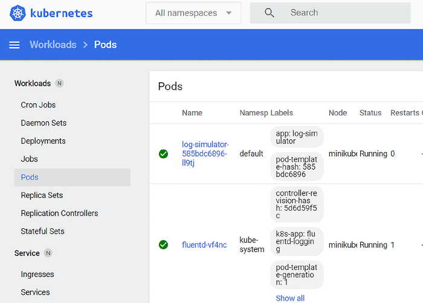
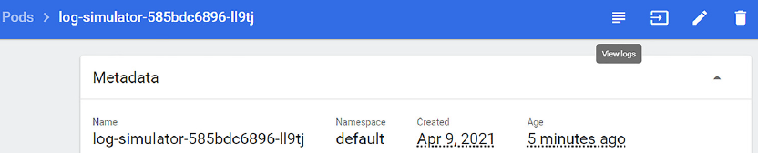
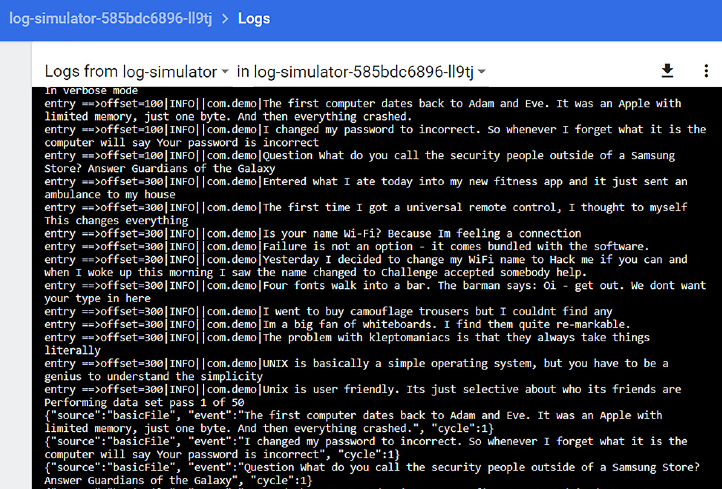
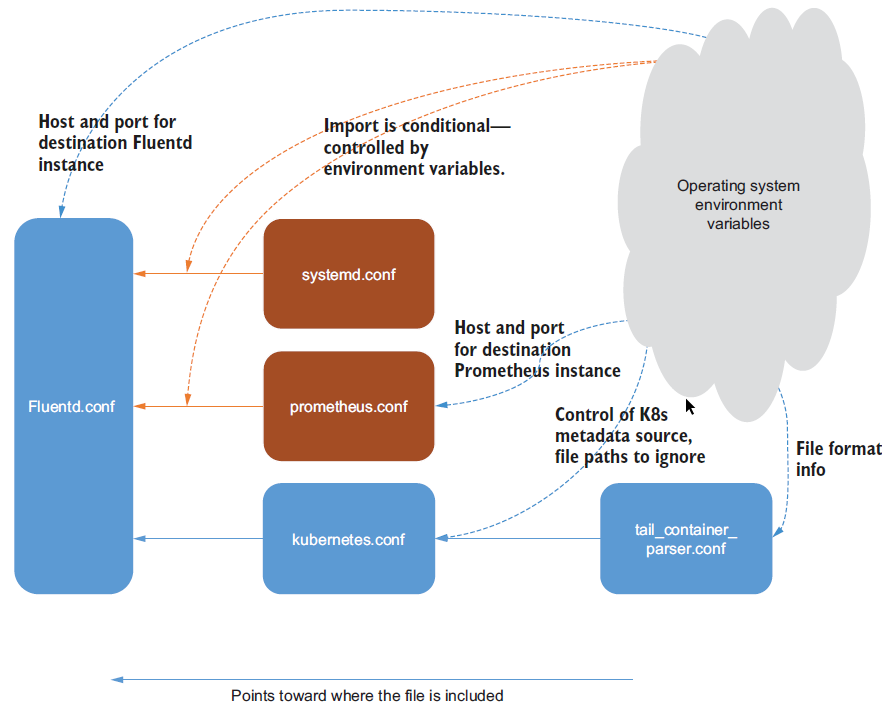

## 8.1 Fluentd out of the box from Docker Hub
The previous chapter illustrated a range of deployment configurations, including patterns
applicable in a Kubernetes environment. These use cases can be addressed
directly using predefined containers provided by Fluentd and others and published in
the central Docker Hub repository (https://hub.docker.com/r/fluent/fluentd/).
The container has been configured so that it is possible to pass a location to write output
log files—this allows appropriate mount points to be used and allows the logs to
be accessed from outside of the container, avoiding the issue of losing logs when a
container terminates. In addition to the location for log files, we can also pass in our
own custom Fluentd configuration if the default is insufficient. The default settings
include the following:
* Port 24224 is used for receiving logs using the forward plugin.
* Logs tagged with Docker.** are written to /fluentd/log/docker.log.
* All other logs go to /fluentd/log/data.*.log.
### 8.1.2 Docker log drivers
The purpose of the log drivers is to capture the output streams for stdin, stdout,
and stderr (i.e., the content you would expect to see on a console) and direct them
to a suitable destination; otherwise, this information will “disappear into the ether.”
Docker supplies, out of the box, several bundled log drivers covering
* ``Fluentd``—Communicates with the Fluentd forward endpoint, which must be on
the host machine.
* ``JSON file``—The default setting; stores events in a file using JSON format.
* ``local``—A file-based storage custom to Docker and optimized for its operations.
* ``Syslog``—Integrates with the Syslog product.
* ``journald``—A daemon service that uses the same API as Syslog but produces a
more structured file. This comes with systemd which provides a range of OS services
beyond the Linux core (http://mng.bz/XWZ6).
* ``GELF``—Graylog Extended Log Format; a format adopted by several logging
frameworks such as Graylog and Logstash (https://docs.graylog.org/en/4.0/
pages/gelf.html).
* ``ETW logs``—Windows log events (http://mng.bz/y4vq).
* ``Google Cloud Platform``, ``AWS CloudWatch``, ``Rapid7``, ``Splunk``—Some of the vendors
and platforms that have provided log drivers to their services.

In addition to these Docker-shipped log drivers, you can also build your own. But
unless you want to tightly couple Docker logging to a product or platform, there are
plenty of options without resorting to development.

## 8.2 Using Docker log drivers
Docker provides the means to control what happens to logs. By default, Docker uses a
**JSON log driver** that writes to ``stdout`` and ``stderr`` (i.e., our console unless you’ve
overridden the routing of these outputs in your environment). There are two ways to
control the log driver, either with additional parameters in the Docker run command
or by modifying the Docker configuration. The difference is that the command-line
approach means you can use alternative configurations for specific Docker containers.
The downside of the command-line approach is the parameters need to be provided
every time.
### 8.2.1 Docker drivers via the command line
For our first use of log drivers, we’re going to use the command-line approach. It is
the least invasive approach to tailoring log driver behavior; therefore, experimenting
with configuration controls involves the least disruptive change.

We’ll continue to run a configuration of Fluentd on our host computer to receive
and output log events. First, we will run the ``Hello-World`` Docker image from within
the Linux VM (virtual machine) established using the guidance in appendix A. If your
host operating system is Linux, this may seem a little perverse, but this approach has
the following benefits:
* Clear separation of network layers, as the virtualization layer will provide a separate
network layer besides the network abstractions from the Docker layer.
* Keeps the number of VMs needed down and the resource overhead that virtualization
creates.
* The outcomes will be the same regardless of the host operating system. This can
be particularly beneficial if your host is Windows, as it helps to emphasize that
Fluentd is platform-agnostic.

### 8.2.2 A quick check of network connections
Getting network configurations correct is a significant consideration for using Docker,
Kubernetes, and virtual machines. This means it is always worth doing quick and easy
checks to ensure the network connectivity works as expected, such as using curl or Postman
to send HTTP log events to Fluentd. To help with this and use the Fluentd log
driver, we have prepared a simple Fluentd configuration to send anything received to
stdout. We can start Fluentd just as we have many times before using the command

``fluentd -c Chapter8/Fluentd/forwardstdout.conf``

Once Fluentd is running from the Linux environment, we can execute a variation on
our “Hello World” test used in chapter 2. In the following configurations and commands,
we need to replace w.x.y.z with the host computer’s IP, as seen by the Linux
guest. You can get the IPs of a machine with the command ipconfig on Windows
and ip addr show on Linux hosts (ifconfig may also work but is deprecated). Our
test command on the Linux VM or container has to be`

``curl -X POST -H "Content-Type: application/json" -d '{"foo":"bar"}' http://w.x.y.z:18080/test``

This should result in the JSON details {"foo":"bar"} being displayed on the console
where Fluentd is running on the host.

> #### Strict bind controls
> Strict bind controls can be an excellent thing. They allow us to apply security controls 
> when dealing with components that may reside on machines with multiple network
> connections, regardless of whether those connections are physical or virtual (as is
> the case for Docker and Kubernetes environments). The bind configuration attribute
> for input plugins like ``forward`` will ensure Fluentd invocations will come through the
> relevant networks. But when Docker and Kubernetes create network addresses, we
> must be a lot more aware. When connections fail, it is easy to start looking at host
> firewalls, network configurations, and so on. The reality is that the target system is
> at fault for listening to only one specific network connection.

### 8.2.3 Running Docker command line
Having set and checked our deployment, particularly networking, we can move on to
using the Docker daemon. Rather than build our own Docker image, we will retrieve a
traditional “Hello World” one from the Docker Hub website. The ``hello-world``
Docker image is straightforward, and when people are finding their way with Docker,
it’s a good starting place. Details of the image are available at https://hub.docker.com/
_/hello-world.

We can stipulate a specific version through the use of tags. The tag is added after
the name with a colon separator. As the ``hello-world`` Docker image has been tagged
following the convention of using a ``latest`` tag for the most recent stable version, we
can add ``:latest`` to the command. This can be done by running on the VM the
Docker CLI command

``docker pull hello-world:latest``

We haven’t made any changes to the Docker configuration, which means we will see
the standard Docker log driver behavior when asking the Docker daemon to run our
image. While the location of Docker logs can vary, typically we should locate them in
the folder ``/var/lib/docker``, where we will see a folder called ``containers``. We can
see this as highlighted in section 1 of figure 8.2, with each container instance having
its own folder created using its unique ID. Of course, there won’t be any containers
present initially. With a local copy of the image now available, we should tell Docker
daemon via the CLI to run the ``hello-world`` image using the command

``docker run hello-world``

If we now refresh our view of the folder ``/var/lib/docker/containers``, the folder
will have a new entry, highlighted in section 2 of figure 8.2. In the new container’s
folder structure, we will see a log file with a long name (Docker image instance; e.g.,
b361e69a1 . . .). Navigating into a container’s folder, we’ll see the resources for that
Docker instance, including a folder called ``local-logs`` (highlighted in section 3 of
figure 8.2). Finally, navigating into the ``local-logs`` folder, we can see the container’s
log file called ``container.log`` (highlighted in section 4 of figure 8.2). The log file
contents will be unreadable because it’s stored in its own custom format (section 5 of
figure 8.2).

To make things more practical, we want to configure Docker to log using a more
consumable format. We can override the default settings, so Docker uses the Fluentd 
log driver. This is done by telling the Docker daemon to use an alternative with the
parameter ``-–log-driver=fluentd``. We don’t need to do anything more, as the Fluentd
driver is bundled in the deployment of Docker. We also need to tell the driver
where to find our Fluentd node to receive the log events. This and other configuration
options are provided using the parameter ``-–log-opt`` followed by a name-value
pair separated by the equals (=) character. In our case, we need to give the address
(just like the previous curl command) of our host machine’s Fluentd. As the Docker
log driver can use the forward plugin (and benefit from msgpack providing compression),
we need to ensure the network address, including that port, is provided. This
results in the command to run ``hello-world`` like this:

```bash
docker run –-log-driver=fluentd --log-opt fluentd-address=w.x.y.z:28080  hello-world
```

The outcome of executing the statement will be to see log events from the Docker
image being output on the Fluentd console. If the Docker command returns with an
error message such as
```bash
docker: Error response from daemon: failed to initialize logging driver: dial
tcp w.x.y.z:28080: connect: connection refused.
```
then something is wrong on the network or in Fluentd (e.g., it is not binding to the
correct network). The order in which the docker image and the target Fluentd node
are started up should also be noted. This will become particularly important when
moving into container orchestration with Kubernetes, as it manages the order in
which pods start up. In the event of such issues, we would recommend checking the
Docker configuration values for network ports to ensure network traffic is allowed out
of the container. If any port number mapping is happening, then that is fine.

The Fluentd driver can use any of the standard features Fluentd offers, such as
making communication asynchronous (i.e., exploiting the memory buffer capabilities;
more on this in chapter 9). But we’ll look at more of these when we move to the
complete configuration.

In figure 8.3, we can see the output generated from running our command. Notice
how the log events include the following attributes:
* ``container_id``—The complete 64-character ID of the container uniquely
identifying an individual container.
* ``container_name``—The name of the container when the container was
started. Any renaming actions after the startup aren’t reflected until restarted.
* ``source``—Details whether the log came from stdout, etc.
* ``log``—The content from the source (e.g., a line from stdout).


### 8.2.4 Switching to driver configuration through a configuration file
With a parameterized solution proven, we can advance the configuration in a more
readable manner and add further options that are relevant. Given all the possible configuration
options, using a command line for an advanced configuration will make for
a challenging maintenance task. By default, changing the Docker daemon configuration
file will impact all Docker images being run. The Docker command line also
allows us to point to a configuration file with the parameter ``–-config``, followed by
the filename for alternate configuration.

The Docker daemon keeps its configuration, including the log driver configuration,
in a file called ``daemon.json``. The default location for the file is ``/etc/docker/``  for Linux setups. If you use an instance of Docker on Windows (rather than the indirect
approach we’ve chosen to adopt), the location is ``ProgramData\docker\config\`` (``ProgramData`` is typically found on the C drive root). It is possible that the
file does not exist if the Docker setup is running entirely on default values.

In the daemon configuration file, we clearly want to include the setting of the type
of log driver and connection to our Fluentd instance. To do this, we include into the
JSON file the configuration version of the command line parameter ``"log-driver":"fluentd"``. In the command line, we also provided the ``fluentd-address`` attribute.
When it comes to the ``fluentd-address``, we can provide the address as ``tcp://w.x.y.z:28080`` or as an explicit path reference to the relevant socket file (e.g.,
``unix:///usr/var/fluentd/fluent.sock``).

In addition to the address, we should also introduce several additional parameters
directly related to the log driver and other general parameters relevant to logging.
The general settings we’ve included are
* ``raw-logs``—Should be set to either ``true`` or ``false``. If specified as false, then
a complete ANSI timestamp is applied (e.g., ``YYYY-MM-DD HH:MM:SS``), and the
coloring of the log text through the use of escape codes is switched off from any
encoding.
* ``log-driver``—As shown in the command line example used to set the log driver.
* ``log-level``—The log filter threshold to apply to Docker daemon. The
accepted levels are ``debug``, ``info``, ``warn``, ``error``, and ``fatal``, with the default
being info.

Within the configuration file, we can start an inner group of attributes called logopts;
these logging specific options include
* ``env``—We can ask the driver to capture and include specific environment variables.
This is done by defining a comma-separated list. For our purposes, we
can use "``os, customer``". This does assume that something has set such values.
It is also possible to define a regular expression version of this by using the attribute
env-regex.
* ``labels``—This works very much in the same way as env, insofar as a list of labels
(Docker metadata name-value pairs) can be specified, or a regular expression
can be provided via ``labels-regex``.
* ``fluentd-retry-wait``—Each time a connection fails, a waiting period is
applied before retrying again. The value needs to include the duration type
(e.g., s for seconds, h for hours).
* ``fluentd-max-retries``—The maximum number of connection retries before
giving up. This defaults to ``4294967295``—that is, ``(2**32 - 1)``. We don’t want
things hanging for that many retries. Given that we have set retry to one per second,
up to 10 minutes retrying would be plenty, meaning a value of ``600``.
* ``fluentd-subsecond-precision``—Allows us to get the timestamp precision
to millisecond accuracy if the hardware is capable of it. While the default value
is false, it is worth setting explicitly, even if it’s to the default value. By explicitly
setting the value, we’re reminded that we won’t have such precision.
* ``tag``—The tag to associate with the log event record. This can be built using several
predefined values (the complete list is in appendix A) using a notation
defined by Docker. In our case, let’s define the tag using the shortened ID and
Image ID using the following representation: ``{{.ID}}-{{.ImageID}}``.
* ``fluentd-address``—As in the command-line configuration, this is the location
of the Fluentd server to talk with. This, as with the parameter approach, needs
to be tailored to the host IP of the Fluentd instance.

The outcome of addressing these other needs means we arrive at the code shown in
listing 8.1. Running the Docker daemon process in debug mode is the easiest way to
ensure that the configuration file is processed correctly. This means that as this is a
daemon service, we need to stop the current process using the command

```bash
sudo service docker stop
```

> Listing 8.1 Chapter8/Docker/daemon.json configuration for Docker Fluentd log driver
```json
{
"log-driver" : "fluentd", // This tells Fluentd to use the Fluentd version of the log driver.
"log-level": "debug",
"raw-logs": true,         //This is setting Docker to use raw logs, so the formatting isn’t used, and the ANSI timestamp is applied.
  "log-opts": {
    "env": "os,customer",
    "labels": "production_status,dev",
    "fluentd-retry-wait": "1s",
    "fluentd-max-retries": "5000",
    "fluentd-sub-second-precision": "false",
    "tag": "{{.ID}}-{{.ImageID}}",       //This tailors the tag to be used in the log events.
    "fluentd-address": "w.x.y.z:28080"   //This specifies to the log driver where the Fluentd server is.
  }
}
```
Once the service has stopped, we need to copy our modified daemon configuration file to the default location ``/etc/docker/``. Then we can start the process manually
with the command
```bash
sudo dockerd -D
```
This will launch Docker in debug mode, picking up the configuration from the default
location. If there are any issues with the configuration file, the Docker daemon will
almost immediately stop or generate warnings about not parsing the configuration.
Messages will be displayed on the console, such as

```bash
unable to configure the Docker daemon with file /etc/docker/daemon.json:
invalid character '\n' in string literal
```

Once the file is read okay, the Docker daemon will direct log events to our Fluentd
instance, including the output when running the ``Hello-World`` docker image. As our
previous command has started the Docker daemon in the foreground, we need to use
an additional shell to run the docker image. We can use the same command as before:
```bash
docker run hello-world
```
If you’re feeling brave, then you can jump straight to running Docker as a service
again. This means terminating the current execution of the Docker daemon process
in debug mode. Then execute the command
```bash
sudo service docker start
```

When you’re confident about any further changes to the configuration file (``daemon.json``), rather than running the Docker daemon manually, we can adopt an
approach of simply restarting the daemon to force it to pick up the latest config. This
is done by replacing the start command with restart. For example:
```bash
sudo service docker restart
```

Suppose you want to verify that config attributes have been accepted by the Docker
daemon. In that case, it is possible to run the command ``docker --info``, which will
display all the settings being used, including those defaulted values on the console.

## 8.3 Kubernetes components logging and the use of Fluentd
The nature of Kubernetes and the model making it highly pluggable means that the
landscape can become complex. To illustrate this, if we look at the containerization
aspect of Kubernetes, Docker may be the most predominant container technology
today. Still, Kubernetes, through the API model, allows us to use other container technologies
such as ``containerd`` (https://containerd.io/) and cri-o (https://cri-o.io/), both
under the governance of CNCF. Some of the complexity is addressed through the
``Open Container Initiative`` (https://opencontainers.org/), also under CNCF governance,
which helps abstract the interaction between the container implementation and
Kubernetes’s orchestration of containers. The essential question here is how does that
impact us and the use of Fluentd?

The important thing here is that, as we have seen, we can configure Docker to capture
the events propagating through ``stdout`` and ``stderr``; therefore, do the other
containers support such a capability? Not all containers are as mature as Docker when it comes to logging. Many simply line up with Kubernetes’s internal logging framework
``klog`` (https://github.com/kubernetes/klog), which adopts the logging approach
of using ``journald`` when it is deployed, and otherwise logging to a default file location.

> ### Klog’s evolution
> Klog goes back to the Google C++ libraries (https://github.com/google/glog). As Kubernetes is implemented in Go, C++ libraries aren’t an option, and along the way,
> a Go implementation was developed (https://github.com/golang/glog). Since then, the Kubernetes developers determined that glog presented some challenges regarding
> containerization and thus forked the code base, leading us to klog. The APIs remain essentially the same. In all cases, the logging mechanisms are streamlined
> for optimal performance; thus, plugging and configuring logging is very much down to command-line options offered by an application using the library rather than a   configuration file.

### 8.3.2 Kubernetes default log retention and log rotation
When the logs come through to Kubernetes from a container because of the container
configuration, Kubernetes will push the log entries into a log file for each container
instance. To manage the size and log rotation, it is our responsibility to
establish a log rotation tool, which can control how many log files and how frequently
they are rotated.

Kubernetes doesn’t have its own log rotator; it is the responsibility of the deployer
of Kubernetes worker nodes to address log rotation challenges. That said, if the worker
node is set up using a Kubernetes provided script (``kube-up.sh``, http://mng.bz/
M25n), it will deploy the open source tool logrotate (https://github.com/logrotate/
logrotate). Logrotate can be configured to retain a specified number of files. Some flavors
of Linux will have logrotate deployed, so it is a matter of additional configuration.
How logrotate is set up can vary across Linux flavors only because of how the Linux configuration
is applied. Some flavors use systemd, and logrotate is provided as part of that.
Where logrotate isn’t already deployed, it is typical to be able to perform an independent
installation via the Linux flavor’s package manager of choice.

Logrotate is not cross-platform as a solution, so running Kubernetes on Windows
needs another answer to achieve log rotation, which isn’t obvious and more challenging
when examining the Kubernetes discussions on the subject. Regardless of log rotation,
logs generated by klog are automatically truncated when they reach 1.8 GB. So any log
rotation needs to be established to occur before hitting that threshold.

Kubernetes will automatically delete all except the current log files when a container
is removed. If the process of capturing such log events is too far behind, there is
a risk of losing log events—something to be considered when establishing log capture.

The takeaway from this is that managing logs at the Kubernetes layer presents challenges
with potential differences based on the deployment approach and infrastructure
setup. As a result, our preference is to minimize the issues by focusing on log
capture in the layers where we can see more consistency and the means to assert more
control. We can’t entirely ignore Kubernetes logs, but intercepting the log events elsewhere
means the loss of Kubernetes log events isn’t as critical.

> #### Easing of deployments into Kubernetes
> The easing of deployments into Kubernetes for solutions is necessary. Within the
> Kubernetes ecosystem, several tools, such as Helm (https://helm.sh) and Rancher
> (https://rancher.com), have been developed to ease the challenges. Helm (the more
> dominant solution) even refers to itself as the package manager for Kubernetes.
> Given Helm’s dominance, the Fluentd committers have developed Helm configuration
> files (known as charts) to support Fluentd deployment. The charts consolidate and
> define the configuration details unique to deployment, and then Helm uses templates
> and scripts to complete the rest. The DaemonSet chart included in the GitHub Fluentd
> repository (https://github.com/fluent/helm-charts) provides a baseline start, leaving
> you to just apply configurations for your specific needs. If you’re involved with the regular
> development of Kubernetes deployments, then we recommend investigating
> Helm and leveraging the Fluentd charts.


### 8.4.1 Kubernetes setup
To demonstrate the Kubernetes configuration to keep things nice and compact, we’re
going to use minikube. Minikube is a version of Kubernetes pared down to keep the
footprint as compact as possible. If you haven’t already followed the instructions in
appendix A, that is the first step to perform on the Linux virtual machine. It also happens
to be the Kubernetes implementation used in Kubernetes in Action by Marko
Lukša (http://mng.bz/g4wE). Once minikube is installed, let’s fire it up and use the
Kubernetes dashboard to look around at the initial state. We do this with the following
command for Windows:

```bash
minikube start --vm-driver hyperv --hyperv-virtual-switch "Primary Virtual Switch"
```

The Linux equivalent is
```bash
minikube start --vm-driver docker
```

This will establish a single node “cluster” of Kubernetes stripped down to the minimum.
The download package for this chapter contains Linux shell and Windows batch
scripts, which will perform this command (making it a lot easier than remembering or
copying the commands every time). Then we can start up the dashboard with this command
in either Windows or Linux:

```bash
minikube dashboard
```

This command starts a foreground process that will deploy the necessary pods to run
the dashboard UI and provide the dashboard page URL. With the dashboard page
open, we can navigate using the UI’s left-hand menu to see what DaemonSets, Deployments,
and Pods are currently deployed (as part of the Workloads section of the
menu). As you can see in figure 8.5, there are no DaemonSets currently deployed. You
will find the basic ``hello-minikube`` deployment and associated pod running.

> #### Simplify navigation with all namespaces
> Simplifying the UI navigation can be done by setting the drop-down next to the Kubernetes
> logo to All Namespaces rather than default (as shown in figure 8.5); this will
> make seeing details easier. Otherwise, you will likely get tripped up when you navigate
> the UI, wondering why you cannot see expected information, such as the Fluentd
> DaemonSets. Within our environment, displaying everything (i.e., all namespaces) is
> not going to be problematic, although in a production setup, this is not something we
> would recommend.

### 8.4.2 Creating logs to capture
We first need an application to generate log events so we can observe a log DaemonSet
collecting events from Kubernetes and the applications not logging more directly to an
endpoint (i.e., they are simply sending logs to ``stdout`` and ``stderr``). For this, we can
use a containerized version of LogSimulator. The containerized version of this tool is,
by default, configured to loop through a simple data set several times and then stop.
Each log event is simply written to stdout; thus, log events will get collected by Kubernetes.
When the LogSimulator pod completes its run, it will stop the pod, at which
point, Kubernetes will intervene to restart the deployment. The LogSimulator Docker
image already exists within Docker Hub. The Kubernetes configuration to use this
Docker image within a pod is shown in the following listing, which can be retrieved
from http://mng.bz/5KQB. As there is no need for any configuration or external facing
endpoints, the YAML configuration is straightforward.

> Listing 8.2 https://github.com/mp3monster/LogGenerator/blob/master/Kubernetes/log-simulator-deployment.yaml
```yaml
apiVersion: apps/v1
kind: Deployment
metadata:
  name: log-simulator
  labels:
    app: log-simulator
spec:
  replicas: 1
  selector:
    matchLabels:
      app: log-simulator
  template:
    metadata:
      labels:
        app: log-simulator
    spec:
      containers:
      - name: log-simulator
        image: mp3monster/log-simulator:v1  # This is the reference to the Docker Hub image, which, when deployed, will be downloaded. 
                                            # If a newer version of this pod needs deploying, the version reference at the end of the name (i.e., :v1) must be updated.
                                            # Without this, Kubernetes will ignore the request as it already has that version of the LogSimulator.
        ports:
        - containerPort: 80     
```
To deploy this pod, you need to ensure the environment variable ``LogSimulator-Home`` is defined, which references the root folder of the LogGenerator that has been
previously installed. Alternatively, edit the provided script (``deploy-log-simk8.bat`` or ``deploy-log-sim-k8.sh``), replacing the environment variable reference
with the absolute path. If you use the script, it will always try to remove any possible
existing pod deployment first to be safe. This means that if you want to keep redeploying,
then just use the script. To issue the deployment command yourself, then, in a
shell, issue the following statement:

```bash
minikube kubectl -- apply -f %LogSimulatorHome%\Kubernetes\log-simulatordeployment.yaml --namespace=default
```

Minikube should confirm the deployment as being successful.

> ##### Difference between minikube CLI and kubectl
> The difference between kubectl and minikube commands is minimal. Minikube has wrapped the use of kubectl so that the minikube command can provide additional
> commands and the kubectl commands. If you have installed kubectl, it is possible to configure it to direct instructions to the minikube instance of Kubernetes. Then you
> can replace the first part of the commands, which appear as ``minikube kubectl –-``, with just kubectl. An alternate approach to this for Linux hosts is to introduce
> an alias into the Linux environment. This is done by using the command ``- alias kubectl="minikube kubectl --".`` Now when you use the command ``kubectl``,
> Linux will substitute it for the full expression. If you find yourself having to prefix a lot of the calls with ``sudo`` to ensure the privileges are correct, you could  incorporate that into the alias as well.


##### UNDERSTANDING LOGSIMULATOR’S VIEW
Before we move on to look at the DaemonSet, it is worth taking a “little peek under
the hood” to see things happening. As we’ve previously started the Kubernetes dashboard,
we can use this to help us. We need to access the list of pods (left menu
option); thus, we will see a list like the details shown in figure 8.6. We need to access
the ``log-simulator`` pod instance, which can be done by clicking on the name that
starts with ``log-simulator``.


  
Figure 8.6 Kubernetes dashboard showing the instances of pods that contain our LogSimulator and Fluentd

This will display the details about the specific pod, and the top of the screen will look
something like the details shown in figure 8.7.

  
Figure 8.7 Kubernetes dashboard showing a specific instance of the log-simulator

As you’ll note in figure 8.7, there are four icons in the top right-hand side of the
image. Clicking on the first icon will display a view like the one in figure 8.8. The figure
shows us the ``stdout`` being generated by the LogGenerator.


  
Figure 8.8 The console (stdout) of our instance of the LogGenerator with its simple configuration generating events to be collected by our Fluentd setup

While this is useful and confirms the container is functioning as expected, we need to
know which file Kubernetes is pushing this output to, as we need to set up a tail input
plugin against that file. Returning to the screen, we saw in figure 8.7 that we want to
use the arrow-based icon (second from left), as this will provide us with a shell view
into the container being executed.

It is also worth logging into a shell provided by this container image, because you
will see the environment as your application will. Any container exploration needs to
be quickly done—once the LogGenerator has completed generating log events, it will
stop. As a result, our container will die, taking our session with it. If you try to see what
logs exist, you shouldn’t see anything, as the log events will be captured on the host
running Kubernetes, not in the container. By doing this, we have clearly established
the first of the requirements of our Kubernetes container—the fact that access to the
host file system is needed to collect the logs generated.

### 8.4.3 Understanding how Fluentd DaemonSets are put together
Our first contact with Kubernetes was in chapter 2, where we looked briefly at using a
DaemonSet provided by Fluentd. We’ve said Kubernetes configuration gets complex.
However, it would be easy to question this given the ``Kubernetes.yaml`` we’ve used
for the LogGenerator. Let’s take a moment to step through what is involved with the
Kubernetes and Docker resources for Fluentd. There are a couple of crucial repositories
relevant to this, specifically the following:
* ``Kubernetes DaemonSet in GitHub``—This is where most of the necessary implementation
details are (http://mng.bz/6ZXo).
* ``Docker file base images``—(https://github.com/fluent/fluentd-docker-image).
These are the Docker base images, including the template mechanism used to
help generate the different OS variations.
* ``Docker Hub repository``—This is where the Docker images are pulled from for the
Kubernetes configuration (https://hub.docker.com/u/fluent). One or more
Docker images form a pod based on the configuration provided.
* ``Metadata filter``—This is incorporated into the DaemonSet (http://mng.bz/
oa2d). The metadata filter enriches the Kubernetes log records with additional
context to help you better understand what is happening.

When you visit the GitHub repository for Fluentd’s DaemonSets, you see a range of
YAML files. The Fluentd community has provided a range of standardized configurations
for capturing Kubernetes logging and sending the contents on to a single destination.
The configurations range from forwarding the content to another Fluentd
node, to sending to various cloud-native services provided by AWS, Azure, and Google,
to dedicated services such as Graylog, Loggly, and the more common targets Elasticsearch
and Syslog.

When examining the Kubernetes YAML configurations, you’ll see they are all very
similar in nature, with the following characteristics:
* Setting the image up, so it will be deployed in the kube-system namespace
* Referencing a suitable container image
* Defining environment variables that can be used in the relevant Fluentd configuration
file to connect with the external service—typically details such as the
host and port of the target solution
* Specifying the number of resources that should be allocated to the container
* Defining the host-file locations that need to be visible within the container—
specifically ``/var/log`` and ``/var/lib/docker/containers``—and how the
path should be seen within the container.

What isn’t shown in the configurations is that some additional environment variables
can be set and passed through, further changing the container’s behavior; for example,
whether to try and interact with systemd. But we’ll see this in more detail shortly.
We can assume that the “real magic” occurs in the container, and therefore in the
Docker file.

#### KUBERNETES DOCKER IMAGES
If you examine the README in the repository’s root, you’ll see a list of Docker pull
commands, with one or more references for each type of daemon. Looking through
the list, you’ll note they have been broken into two major groups: ``x86_64 images``
and ``arm64_images``. The need for this may not be immediately apparent until we
remember that the Docker file has to ultimately reference binaries specific to the
computer hardware. This is a downside of delivering virtualized or containerized solutions
over using a more generic package manager. This means we have a lot of Docker
images to maintain.

The Kubernetes Docker images are also generated using templates, but we can
characterize the activities as doing the following things:
* Establishing a dependency on the relevant Docker image
* Setting up Ruby and Gem, including defining environment variables to the
appropriate locations
* Installing various gem files
* Configuring files covering Fluentd, systemd, Kubernetes, Prometheus

Using an example such as https://github.com/fluent/fluentd-kubernetes-daemonset/
tree/master/docker-image/v1.12/arm64/debian-forward/conf, we can examine
the configuration and file relationships in detail. Figure 8.9 also provides a visual representation
of the file relationships:

* ``Fluent.conf`` is in the root container and uses the include mechanism to
bring in the contents of other configuration files, as we saw back in chapter 5.
This configuration file also has a single match that, in the case of the forward
DaemonSet, matches all log events and sends them on to the target server. It is
worth noting that the forwarding configuration does not include any security
(no TLS, etc.); this isn’t a problem if the logs are not sensitive. But if they are,
then you will need to replace the configuration files with ones that include the
necessary configuration. We’ll see more of how this can be done later in the
chapter.
The inclusion of the systemd and Prometheus configurations are subject to
environment variable controls, specifically the existence of settings for
``FLUENTD_SYSTEMD_CONF`` and ``FLUENTD_PROMETHEUS_CONF``.

The ``Kubernetes.conf`` is needed, so it is included. Finally, any configuration
in the ``conf.d`` folder is included, so extending the configuration with any
specific customizations is possible.


  
Figure 8.9 A representation of the relationship between the configuration files and how they are influenced by environment variables

* The ``Prometheus.conf`` file is straightforward. It defines the use of the input
plugins for Prometheus and ``Prometheus_output_monitor`` to monitor Prometheus.
Environment variables define the server addresses to ``bind``, ``port``, and
a ``path`` if the metrics URI are different using the variables ``FLUENTD_PROMETHEUS_BIND``, ``FLUENTD_PROMETHEUS_PORT``, and ``FLUENTD_PROMETHEUS_PATH``, respectively.

* The ``Systemd.conf`` file defines the sources for Docker, Kubelet (the Kubernetes
node controller and bootkube service using the systemd source plugin). It is
worth noting that this plugin is separate from the Fluent Git repository and
has been separately authored (details at https://github.com/fluent-plugin-systemd).
* The ``Kubernetes.conf`` file is the most interesting of the inclusions in the configuration.
Like systemd, it also uses an external plugin, this time a filter called
kubernetes_metadata (the details of which can be found at https://github.com/fabric8io/fluent-plugin-kubernetes_metadata_filter). The filter’s job
incorporates or excludes additional metadata into the log events. This is done
by communicating with the Kubernetes API endpoint using the environment
variables ``FLUENT_FILTER_KUBERNETES_URL`` or combining ``KUBERNETES_SERVICE_HOST`` and ``KUBERNETES_SERVICE_PORT``. This requires metadata
from the log events for essential context to retrieve information from the
Kubernetes API. The info can be drawn from the journald if being used or possibly
from the log file names. Some of the attributes used with the plugin either
assume the default values or are hardwired into the container. The controls that
can be configured map to the plugin attributes as follows:

    * ``KUBERNETES_VERIFY_SSL``—verify_ssl sets a flag indicating whether the SSL/TLS certificates should be checked. If your environment has a certificate authority for the certificates used, we recommend this be set to yes.
    * ``KUBERNETES_CA_FILE``—This attribute provides the path to the CA file for Kubernetes server certificate validation.
    * ``FLUENT_KUBERNETES_METADATA_SKIP_LABELS``—Don’t retrieve the labels from the metadata if set to true.
    * ``FLUENT_KUBERNETES_METADATA_SKIP_CONTAINER_METADATA``—If set to true, then the metadata relating to the container image and image_id will not be included.
    * ``FLUENT_KUBERNETES_METADATA_SKIP_MASTER_URL``—If ``true``, the ``master_url`` metadata will not be included.
    * ``FLUENT_KUBERNETES_METADATA_SKIP_NAMESPACE_METADATA``—If set to  true, then the metadata such as namespace_id will be excluded.
    * ``FLUENT_KUBERNETES_WATCH``—When set to ``true``, it tells the plugin to watch for changes in the metadata held by the Kubernetes API server for the pods.

For a filter to do anything meaningful, the configuration needs to include sources. In
this case, the tail source plugin is used multiple times to capture any logs generated in
the folders ``/var/log/containers/*.log``, ``/var/log/salt/minion``, ``/var/log/startupscript.log``, ``/var/log/docker.log``, ``/var/log/etcd.log``, /var/log/kubelet.log, /var/log/kube-apiserver.log, /var/log/kube-controllermanager.log, /var/log/kube-scheduler.log, /var/log/rescheduler.log, /var/log/glbc.log, /var/log/cluster-autoscaler.log, and /var/log/kubernetes/kube-apiserver-audit.log. 

You may have recognized these as the log files for the core Kubernetes processes. Based on this, we should see log events picked up as long as our container’s log events get written somewhere in the ``/var/log/containers/`` folder on the Kubernetes host.

> #### Fluent Bit in Kubernetes
> We have primarily focused on Fluentd with Docker and Kubernetes as the main way
> to provide a flexible means to capture log events. But in a containerized environment,
> Fluent Bit, with its smaller footprint, should be considered, especially if the goal is to
> push the log events out to a dedicated Fluentd node or log analytics platform like
> Elasticsearch and perform the “heavy lifting” with these parts of your solution. It is
> worth noting that Fluent Bit has its own projects within GitHub to provide a Docker
> base setup and to extend Docker images for different environments and operating
> systems, such as Debian, CentOS, Raspbian, and Amazon Linux. The Docker images
> support some possible targets and a Fluent Bit configuration deployed as a Daemon-
> Set in Kubernetes.

## 8.5 Getting a peek at host logs
Earlier in the chapter, we peeked at what our LogGenerator container could see of
the environment and established that it couldn’t see any part of the host, and therefore
any logs. This is because we didn’t configure the container to mount a file system.
A folder mount wasn’t necessary, as we trusted the container to capture ``stdout`` and
put the content in a suitable location. However, when we demonstrated that behavior,
we had control of Docker. Now Docker will be managed by Kubernetes. Additionally,
we need to think about how we monitor Kubernetes itself. A review of the prebuild
Fluentd resources points to the log content residing in ``/var/log``. Minikube provides
a convenient tool that allows easy access to the host environment. Once we can access
the host, we can examine the environment to locate the relevant log files and understand
what needs to be captured. Using a new shell (Windows or Linux), we can use
the command

```bash
minikube ssh
```

This will provide us with a secure shell into the host environment. Let’s look at the
folders we’ve seen in the current configuration using the command

```bash
ls -al /var/log/containers
```
The result is perhaps not as expected, given this is a folder of symbolic links to files in
``/var/log/pods``, as shown in figure 8.10. Fortunately, everyone can see the links.


If we follow the links to ``/var/log/pods``, we see that each link resolves to a folder
that reflects instances of the pods, as shown in figure 8.11.`


Examining one of the pod folders, such as ``log-simulator``, previously deployed
into the default namespace (hence the ``default_`` prefix), we see a folder with incrementing
log file numbers and another layer of symbolic links, shown in figure 8.12.


Following the link into ``/var/lib/docker/containers`` yields a new challenge—the
privileges are greatly restricted, and we need to use a ``sudo`` command to list the
folder’s contents, as shown in figure 8.13.


If we look inside one of these folders, we find the log files shown in figure 8.14. But the
last couple of steps have worked only with elevated permissions. It also helps us understand
the different file paths being used in the predefined configuration. This means
that in the YAML file, we need to ensure that the mounts work with appropriate permissions.
It also confirms that the paths inside the containers are the same as the host.

We should also note that minikube’s log access security is very coarse-grained, and as a
result, if you can see one log, you’ll be able to access them all if you interact with the
host. In a production context, this is not very desirable from a security perspective.
The takeaway is if you’re sensitive about logs in a containerized environment, control
the visibility more directly using patterns such as the sidecar, as discussed in chapter 7.
Taking more active control of your container’s log events means you won’t be subject
to how access controls are managed in Kubernetes.

Navigating through the file system makes it clear that the way Kubernetes is configured
is not trivial. This brings us back to the point that the more we can monitor at
the container and application levels, the easier things will be.

## 8.6 Configuring a Kubernetes logging DaemonSet
Given the overview, it would be reasonable to assume that we can copy the configuration
YAML to establish the Kubernetes DaemonSet for logging. We can leverage the
existing Docker images provided by Fluentd in our configuration. The YAML configuration
will need to give specific environment variable values and mount the right parts
of the file system. If we wanted the DaemonSet to also apply some customized configuration,
we would need to map additional configuration files into the system.

Rather than set a lot of environment values to control the current Fluentd configuration,
we can look at how we can point Fluentd to an alternative configuration file
and inject the modified configuration. This also gives us a chance to address content
layout in a Docker file that can impact downstream applications.


### 8.6.1 Getting the Fluentd configuration ready to be used
With the customized Fluentd configuration, we could deploy this by modifying the
Docker build. However, a more elegant way is to exploit the features of the Kubernetes
configuration. This means if we wish to alter the configuration, we only need to
redeploy a configuration change rather than changing the Docker image and the
subsequent steps involved in redeploying it. This is made possible because the Fluentd
Docker files work by configuring Fluentd through environment variables and
suitably placed additional configuration files that can be picked up through the
includes statements.

With our Fluentd configuration established, we need to get it ready to be consumed
by the container. We’ll do this using a Kubernetes ConfigMap, which we’ll
explain a bit more shortly. We need to start by deploying the ConfigMap into Kubernetes,
ready to be referenced. The ConfigMap can be included in our core Kubernetes
YAML file, or we can use the Fluentd file, translate it to a suitable format, and
deploy the configuration separately. This latter approach is more desirable, as we can
check the configuration using the Fluentd dry-run feature we saw in chapter 3 to validate
the configuration before deploying. If the configuration is embedded in the
larger configuration file, the validation step won’t be possible.

The Fluentd ConfigMap is associated with the kube-system namespace to match
the fact that the standard Fluentd DaemonSet is deployed into that namespace. The
use of this namespace makes sense; in this case we’re configuring and deploying a
Kubernetes-wide service. Listing 8.3 shows the Fluentd configuration that we want to
introduce. As you can see, it sources logs from the containers and pods and sends the
log events to a configurable target. We also need to note the name of the ConfigMap
(``fluentd-conf``), as this will be referenced in the YAML file. As with the LogSimulator
deployment, we’ve bundled a batch and shell script, removing any previous configuration
(``deploy-config.bat`` and ``.sh``).

To deploy the configuration file, we need to use the minikube command:

```bash
minikube kubectl -- create configmap fluentd-conf –from-file=Fluentd/custom.conf --namespace=kube-system
```

If you want to confirm the deployment, use the dashboard to view the configuration
and select Config Maps (from the left-hand menu). Then, in the center part of the
dashboard, you’ll see all the ConfigMaps, including our ``fluentd-conf``. The content
of the ConfigMap can then be displayed by clicking on the name of our ConfigMap.
You may see each line terminated with ``\r``; this is the Linux encoding of a carriage
return and won’t present any issues when the file is processed.

> Listing 8.3 Chapter8/Fluentd/custom.conf overriding configuration for Kubernetes
```conf
<system>
    Log_Level debug
</system>

<source>
  @type tail
  path /var/log/containers/*.log
  read_from_head true
  read_lines_limit 25
  tag deamonset
  path_key sourcePath
  emit_unmatched_lines true
  <parse>
    @type none
  </parse>
</source>

<source>
  @type tail
  path /var/log/pods/*/*.log
  read_from_head true
  read_lines_limit 25
  tag deamonset2
  path_key sourcePath
  emit_unmatched_lines true
  <parse>
    @type none
  </parse>
</source>

<source>         # This source is part of the secured file system and needs the privileges set to allow Fluentd to read. 
  @type tail
  path /var/lib/docker/containers/*.log
  read_from_head true
  read_lines_limit 25
  tag deamonset2
  path_key sourcePath
  emit_unmatched_lines true
  <parse>
    @type none
  </parse>
</source>

<match *>
    @type forward
    <buffer>      # We’ve set a very short-lived buffer so we can see the events flowing through quickly; given our deployment, the networking overheads aren’t an issue.
      buffer_type memory
      flush_interval 2s   
    </buffer>
    <server>
      host "#{ENV['FLUENT_FOWARD_HOST']}"  # Allows the addressing of the server to be driven through the Kubernetes configuration file
      port "#{ENV['FLUENT_FOWARD_PORT']}"
    </server>  
</match>

```

#### PASSING CONTENT TO THE CONTAINER THROUGH KUBERNETES
Kubernetes provides a range of ways to share content into a container as a mount
path. The number of options is such that Kubernetes in Action has several chapters dedicated
to the subject. Essentially, the different techniques can impact whether the container
can modify the file system, whether the storage has persisted beyond the
container's life, and so on. A ConfigMap is immutable (read-only), which is ideal for
our scenario. The contents of a ConfigMap can be consumed through environment
variables, command-line values, and files, depending upon the options used. However,
they are limited in size, so they may not be suitable if you wish to pass over a log
file to be replayed.

When sharing files into Kubernetes-managed containers, we must be mindful that
any content already in the folder (volume) of the container receiving the shared
folder will effectively get overwritten with the shared content from Kubernetes. So,
pushing new configurations into the container needs to be done carefully. For example,
replacing just the ``Kubernetes.conf`` file in the standard Docker setup wouldn’t
be wise because it shares a common folder with all the configuration files. By adopting
the approach used in the containers of putting the new configuration files into a different
location and modifying the path to the configuration file Fluentd picks up via
the environment variable, we protect ourselves from such issues. This means if we
wanted, we could include the standard Kubernetes and Prometheus configurations
and then replace them when necessary.

### 8.6.2 Creating our Kubernetes deployment configuration
Let’s adapt and deploy that standard Fluentd repository DaemonSet for our minikube
environment. To do that, we need to download the file locally, as we need to make a
couple of tweaks. This can be done by using either a ``wget`` command on the raw view
(http://mng.bz/OGpE) or by using the ``git clone`` command. My preference is ``wget``
(it’s the easiest way to retrieve lots of things in Docker files, etc.), which looks like
```bash
wget https://raw.githubusercontent.com/fluent/fluentd-kubernetes-daemonset/master/fluentd-daemonset-forward.yaml
```
We need to then make the following additions and modifications:
1. Set the values for the location of our Fluentd node that we want to forward the
log events to. This means we should replace the text ``REMOTE_ENDPOINT`` with
the address or IP of the host machine (e.g., 192.168.1.2). The value for the ``FLUENT_FOWARD_PORT`` also needs to be changed from 18080 to 28080. This
is to reflect the port being used in our Fluentd node configuration.

In a production setup, we would always recommend this be a DNS address.
That way, any changes in the environment or scaling Fluentd with load balancing
are masked from the configuration. This will require understanding how
DNS is handled within Kubernetes, which is not a subject for this book.

2. Add the environment variable ``FLUENTD_SYSTEMD_CONF`` into the ``env`` section
of the YAML, and set its value to "FALSE".

3. Override the ``FLUENTD_CONF`` environment variable in the same section so that
it points to our ``custom.conf`` file we’ve supplied via the ConfigMap.

4. Add a ``securityContext`` section to the container’s part of the YAML file with
the ``privileged`` attribute set to ``true`` to overcome the previously identified
permissions challenge.

5. Add the volumeMount entry for our ConfigMap so that the path is defined as
expected. This means adding to the ``volumeMounts`` section an additional
name called ``config-volume``, a ``mountPath`` of ``/fluentd/etc/custom``.

6. We then reference the volumes section as an additional entry with the name of
``config-volume`` (linking the volumes and ``VolumeMounts``) with an attribute
of ``configMap``, which is then referenced by name, which we previously set up as
``fluentd-conf``.

As we have tailored the existing configuration, you will still reference the Docker
image defined by the Docker file at http://mng.bz/p2dz. The actual Docker image
will come from Docker Hub at http://mng.bz/QWvG. The result of tailoring the
Kubernetes YAML file can be seen in the following listing.`

> Listing 8.4 Chapter8/Kubernetes/fluentd-daemonset.yaml modified for our requirements
```yaml
apiVersion: apps/v1
kind: DaemonSet
metadata:
  name: fluentd
  namespace: kube-system
  labels:
    k8s-app: fluentd-logging
    version: v1
spec:
  selector:
    matchLabels:
      k8s-app: fluentd-logging
      version: v1
  template:
    metadata:
      labels:
        k8s-app: fluentd-logging
        version: v1
    spec:
      tolerations:
      - key: node-role.kubernetes.io/master
        effect: NoSchedule
      containers:
      - name: fluentd
        image: fluent/fluentd-kubernetes-daemonset:v1-debian-forward  # We continue to reference the prebuilt Fluentd Docker image setup for managing logging for Kubernetes.
        env:
          - name:  FLUENT_FOWARD_HOST    # The IP and port for the log events to be forwarded to, set by using environment variables
            value: "192.168.1.130"
          - name:  FLUENT_FOWARD_PORT
            value: "28080"
          - name: FLUENTD_SYSTEMD_CONF
            value: "FALSE"
          - name: FLUENTD_CONF           # Overrides the location of the configuration file to be used when Fluentd starts up
            value: "custom/custom.conf"
        resources:
          limits:
            memory: 200Mi
          requests:
            cpu: 100m
            memory: 200Mi
        volumeMounts:
        - name: varlog
          mountPath: /var/log
        - name: varlibdockercontainers
          mountPath: /var/lib/docker/containers
          readOnly: true         
        - name: config-volume                  # Defines the mount location that the container will see. 
                                               # This path is then mapped to a file system outside of Kubernetes, giving us assurance the logs can be safely retained.
          mountPath: /fluentd/etc/custom/
        securityContext:                       # The additional security setting so that the container can access the restricted folders and files we saw when exploring the host server
          privileged: true
      terminationGracePeriodSeconds: 30
      volumes:
      - name: varlog
        hostPath:
          path: /var/log
      - name: varlibdockercontainers
        hostPath:
          path: /var/lib/docker/containers
      - name: config-volume                   # Maps the volume to the ConfigMap that was loaded into Kubernetes earlier
        configMap:
          name: fluentd-conf          
```
### 8.6.3 Putting the implementation of a Fluentd for Kubernetes into action
Using the understanding gleaned from chapters 3 and 7 and exploiting the existing
Fluentd configuration files for the DaemonSet (see http://mng.bz/XWZv), construct a
simple single configuration file that tails any relevant files from the Kubernetes
cluster. As the log events are collected, forward them to the Fluentd node previously
used with the Docker log driver configuration.
#### ANSWER
A simple Fluentd configuration has been provided in the download pack as shown in
listing 8.4, which we will utilize for the following steps. Still, there is nothing to stop
you from substituting your configuration into the next steps.

### 8.6.4 Deploying to minikube
Before deploying the DaemonSet, we should start our local Fluentd instance ready to
receive log events. This is the same step as we have done many times before with the
command
```bash
fluentd -c Chapter8/Fluentd/forwardstdout.conf
```

The next step is to deploy to Kubernetes our DaemonSet:
```bash
minikube kubectl -- apply -f Kubernetes/fluentd-daemonset.yaml --namespace=kube-system
```

Again, we’ve made a batch and shell script in the download pack called ``deploy-deamonset.bat`` or ``.sh``, which will remove any preexisting deployment and push
the current configuration into Kubernetes. You can confirm the DaemonSet’s deployment
for the other assets using the dashboard by selecting the menu option for Daemon
Sets (in the left-hand navigation menu under Workloads); this should list
``fluentd``. Clicking on the title will show the details of the pod containing our container.

If Kubernetes has been in a steady idle state, then we may not see any logs immediately.
We can address this by redeploying our LogSimulator configuration as we had
did earlier in the chapter using the script ``deploy-log-sim-k8``. This will quickly
result in various events from Kubernetes being sent across, including the ``stdout`` log
events from the LogSimulator container.  

### 8.6.5 Tidying up
Having run Kubernetes and retrieved various Docker images and minikube assets,
you’ll reach a point where you want to clear or refresh the environment. One of the
simple but excellent features is that minikube will completely wipe the environment
with a single command to release resources because you’ve finished, or reset and start
again if you want to validate everything again. This is done with the command
```bash
minikube delete
```
## 8.7 Kubernetes configuration in action
We have established a basic configuration that gives us a sight of the log events within
a Kubernetes environment. However, the configuration isn’t enterprise-ready. To get
to enterprise readiness, we will need to improve the configuration. Your challenge is
to identify the changes necessary and take the provided configurations and amend
them as necessary.

### 8.7.1 Answer
The changes you have identified should include the following points:
* The tail source is not recording its tracking position in the file; thus, a restart
could duplicate log events.
* The recorded pos_file needs to be mapped to a mount point so that if the
pod is restarted, the position information is not lost.
* The tail configuration needs to address this issue of log rotation being managed.
* The additional Kubernetes metrics and Prometheus information should be
available and controlled through the configuration.
* The Kubernetes core components (in the kube-system namespace) should have
their logs tagged separately to hosted applications and the receiving end separating
out the tags.
* Exploit the Kubernetes plugin to tag the log events with the additional
metadata.
* Tune the caching in Fluentd to be more production-friendly and take into
account the resources provided by Kubernetes.
* The log level should be moved from debug to info.

### 8.8.1 Node monitoring
So far, we have focused on the core logs involved with our containers. But you may
wish to also address the monitoring of the health of the underpinning of the Kubernetes
node. There are various options around this, including using Fluentd or Fluent Bit
on the native node and monitoring the server’s raw statistics. However, this may not be
allowed in some environments. Kubernetes also provides an additional DaemonSet
for a service called the ``Node Problem Detector``.

The node problem DaemonSet is an optional add-on for minikube, and some
other prebuilt Kubernetes clusters provided by cloud vendors and others take this
approach. As a result, the DaemonSet needs to be enabled. The Node Problem Detector
monitors the kernel log file and reports on specific issues based on the configuration,
which can be overridden with a ConfigMap, in the same manner as we have
modified the Fluentd configuration. The detector includes an exporter element that
sends the information to different endpoints, including the Kubernetes API server
and the Stackdriver, which integrates to our Fluentd Daemon.

More information on this service can be found at https://github.com/kubernetes/node-problem-detector.